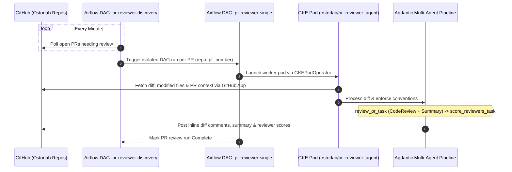

# Automated Bot PR Review System Runbook

Guide to the architecture, Airflow DAG orchestration, multi-agent evaluation pipeline, manual DAG triggering procedures, and troubleshooting for the automated Pull Request review bot (`pr_reviewer_agent`).

---

## 🎯 Architecture & End-to-End Workflow



---

## 🚀 How to Force a PR Review (Triggering the DAG)

When a PR needs an immediate review (e.g. newly pushed commits, re-running after transient failures, or skipping the 1-minute polling loop), trigger the worker DAG `pr-reviewer-single`.

### Required Trigger Parameters

| Parameter | Type | Required | Description | Example |
| :--- | :--- | :--- | :--- | :--- |
| `repo` | `string` | **Yes** | Full GitHub repository name with organization | `"Ostorlab/agent_threat_intelligence"` |
| `pr_number` | `integer` | **Yes** | Pull Request number | `42` |
| `head_sha` | `string` | No | Specific commit SHA to review (defaults to HEAD) | `"8f4b2c1..."` |

---

### Method 1: Airflow Web Console (Cloud Composer UI)

1. Open the Airflow Web UI in your browser.
2. Navigate to the **DAGs** list and select `pr-reviewer-single`.
3. In the top right, click the **Play** button (▷) and select **Trigger DAG w/ config**.
4. Paste the configuration JSON:
   ```json
   {
     "repo": "Ostorlab/agent_threat_intelligence",
     "pr_number": 42
   }
   ```
5. Click **Trigger**. Airflow will immediately schedule the `review_pr` task followed by the `score_reviewers` task.

---

### Method 2: GCP Cloud Composer CLI (`gcloud`)

Trigger the DAG directly from your terminal using `gcloud composer`:

```bash
# Trigger review for a specific PR
gcloud composer environments run <COMPOSER_ENVIRONMENT_NAME> \
  --location europe-west1 \
  --project api-project-609180564266 \
  dags trigger -- pr-reviewer-single \
  --conf '{"repo": "Ostorlab/agent_threat_intelligence", "pr_number": 42}'
```

---

### Method 3: Airflow REST API (`curl`)

If invoking programmatically from a script or webhook:

```bash
curl -X POST "https://<AIRFLOW_WEB_SERVER_URL>/api/v1/dags/pr-reviewer-single/dagRuns" \
  -H "Content-Type: application/json" \
  -u "<AIRFLOW_USERNAME>:<AIRFLOW_PASSWORD>" \
  -d '{
    "conf": {
      "repo": "Ostorlab/agent_threat_intelligence",
      "pr_number": 42
    }
  }'
```

---

### Method 4: Direct CLI Invocation (Local / Pod Debugging)

If you are inside the `pr_reviewer_agent` environment or container:

```bash
# 1. Run the code review agent
python3 /app/agdantic/main.py review \
  --repo "Ostorlab/agent_threat_intelligence" \
  --pr-number 42

# 2. Run reviewer scoring (optional)
python3 /app/agdantic/main.py score-reviewers \
  --repo "Ostorlab/agent_threat_intelligence" \
  --pr-number 42
```

---

## 🔍 Monitoring & Investigating PR Reviews via GCP

> [!IMPORTANT]
> **Always Use `gcloud` for GCP Investigation**: When diagnosing PR review status, DAG execution, Airflow runs, or reviewer worker pod logs, ALWAYS investigate directly via `gcloud` (Cloud Logging, GKE cluster credentials, or Cloud Composer CLI).
> **If Authentication Fails**: If `gcloud` commands fail with expired credentials or prompt for re-authentication (e.g., `invalid_grant`, `invalid_rapt`, or password prompts in non-interactive execution), **immediately ask the user to log in** by running `gcloud auth login` in their terminal before proceeding with investigation.

Once triggered, track the live execution on GKE or query Google Cloud Logging:

```bash
# 1. Authenticate to the production cluster
gcloud container clusters get-credentials production-cluster-2 \
  --zone europe-west1-b \
  --project api-project-609180564266

# 2. Find the dynamically spawned worker pod
kubectl get pods -n default | grep -E "pr-rev-pod|pr-score-pod"

# 3. Stream live logs from the review task pod
kubectl logs -f -n default -l base_container_name=pr-reviewer-review-c

# 4. Alternatively, query Cloud Logging for worker pod or PR events
gcloud logging read 'resource.type="k8s_container" AND resource.labels.pod_name:"pr-reviewer"' \
  --project=api-project-609180564266 \
  --limit=50
```

---

## 🌪 Airflow DAG Orchestration Details

The review system is split into two specialized Airflow DAGs located in `pr_review_agent/dag/`:

### 1. Discovery DAG (`pr-reviewer-discovery`)
- **Schedule**: Runs every minute (`*/1 * * * *`).
- **Function**:
  1. Authenticates with GitHub using the Ostorlab Reviewer GitHub App (`GITHUB_OSTORLAB_REVIEWER_APP_*`).
  2. Scans configured Ostorlab repositories for open Pull Requests that lack an up-to-date bot review.
  3. Dispatches individual child DAG runs (`pr-reviewer-single`) with parameter payload `{"repo": "...", "pr_number": ...}`.
  4. Prevents duplicate concurrent executions using DAG run state deduplication.

### 2. Single PR Worker DAG (`pr-reviewer-single`)
- **Execution Model**: Dispatches containerized pods on GKE (`production-cluster-2`, namespace `default`) using `GKEStartPodOperator`.
- **Image**: `ostorlab/pr_reviewer_agent:latest` (pulled using `dockerhub-credential`).
- **Tasks**:
  1. `review_pr_task`: Runs `python3 /app/agdantic/main.py review --repo ... --pr-number ...` (Generates review comments and PR summary).
  2. `score_reviewers_task`: Runs `python3 /app/agdantic/main.py score-reviewers --repo ... --pr-number ...` (Evaluates comments from other reviewers).
- **Secrets Injected**:
  - `GITHUB_OSTORLAB_REVIEWER_APP_PRIVATE_KEY`
  - `GITHUB_OSTORLAB_REVIEWER_APP_ID`
  - `GITHUB_OSTORLAB_REVIEWER_INSTALLATION_ID`
  - `OPEN_AI_API_KEY` / `OPENROUTER_API_KEY`

---

## 🤖 Multi-Agent Review Pipeline (`agdantic`)

Once the GKE worker pod starts, the `agdantic` engine executes a sequential multi-agent review:

### 1. Diff Token Calculation & Intelligent Chunking
- Changed files (Python, TypeScript, JavaScript, Go, YAML, Dockerfile) are extracted.
- Large diffs are split into logical chunks respecting token boundaries to prevent LLM context exhaustion.

### 2. Specialized Review Agents

| Agent | Responsibility | Core Rules |
| :--- | :--- | :--- |
| **`CodeReviewAgent`** | Analyzes code diffs for defects, security vulnerabilities, multi-tenancy isolation leaks, and conventions. | • Identifies actionable defects.<br>• **Never generates raw fix code blocks** (encourages developer learning).<br>• Focuses on high-impact logic/security bugs. |
| **`ReviewSummaryAgent`** | Aggregates all individual file reviews into a concise PR-level assessment. | • Summarizes PR health.<br>• Categorizes severity (Critical, Major, Minor, Nit). |
| **`ReviewerScoringAgent`** | Evaluates comments made by other human or bot reviewers on the PR. | • Scores other reviewer feedback from **-10 to +10** based on technical accuracy and constructiveness. |
| **`ReportingAgent`** | Interacts with the GitHub REST & GraphQL APIs. | • Publishes inline line comments on the PR diff.<br>• Posts overall PR review status and markdown summary. |

---

## 🚨 Troubleshooting & Failure Modes

### Issue 1: GitHub App Authentication Failure (`401 Unauthorized` / `403 Forbidden`)
- **Symptoms**: Worker pod fails immediately with `BadCredentialsException` or `Resource not accessible by integration`.
- **Root Cause**: GitHub App private key expired or repository permissions not granted to the App.
- **Resolution**:
  1. Check secret `reporting-engine-secrets` in namespace `default`.
  2. Verify GitHub App installation settings in the `Ostorlab` GitHub organization.

### Issue 2: Large PR Diff Context Overflow
- **Symptoms**: Model returns `ContextWindowExceededError`.
- **Resolution**:
  1. Inspect `token_cache` or chunking parameters in `agdantic/utils.py`.
  2. Exclude auto-generated files (e.g. `package-lock.json`, minified bundles, migration files) in the file filter rules.

### Issue 3: Rate Limiting on GitHub API
- **Symptoms**: `403 API rate limit exceeded`.
- **Resolution**:
  1. Ensure requests use GitHub App installation token (which has 5,000 requests/hour per repo) rather than individual personal access tokens.
  2. Check `pr-reviewer-discovery` polling frequency to avoid spamming the PR events endpoint.
