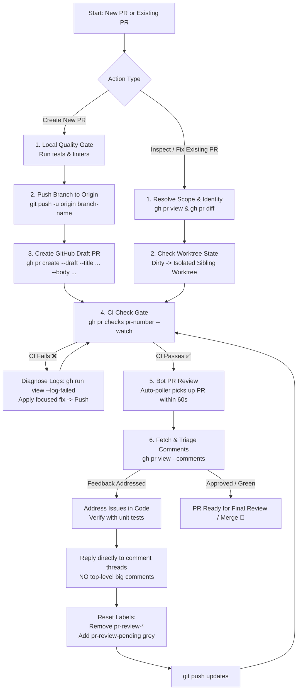

# Pull Request Lifecycle Runbook (`creating-pr`)

Comprehensive standard operating procedure for the entire GitHub Pull Request lifecycle: safe git/CLI authoring boundaries, opening PRs, inspecting existing PRs, diagnosing CI checks, addressing review comments, replying directly to specific comment threads, and managing review state labels.

---

## ⚡ The Mandatory Golden Rules & Safety Invariants

> [!IMPORTANT]
> 1. **Never Create a PR Unless Explicitly Asked**: NEVER create a Pull Request (including draft PRs) unless the user explicitly requests it. Preparing code changes, running tests, or staging commits does NOT give permission to open a PR. Always wait for explicit user instruction before running `gh pr create`.
> 2. **Local Checks Pass First**: Never push code or create a PR without running local test suites and linters (`pytest`, `npm test`, `ruff`, etc.).
> 3. **CI Must Be Green**: Never request human review, mark a PR as ready, or consider work done while CI checks are failing. CI failures must be diagnosed and fixed immediately.
> 4. **Draft PR by Default**: When explicitly requested to open a PR, always create it as **draft** (`gh pr create --draft`) unless the user explicitly requests a ready-for-review pull request.
> 5. **Safety Invariants**:
>    - **Never Merge**: Never merge, approve, auto-merge, enable auto-merge, or ask GitHub to merge a PR.
>    - **No Force-Pushes**: Never push with `--force`, `-f`, or `--force-with-lease`. If force-pushing or rewriting history is required, stop and obtain explicit user permission first.
>    - **Preserve User State**: Never delete a branch, reset or clean away user changes, or alter repository settings without explicit user permission.
>    - **No Disposable Worktrees**: Do not create PR worktrees under `/tmp`. Prefer a visible sibling directory beside the repository, such as `../<repo-name>-worktrees/pr-<number>`.
> 6. **Strict Attribution Bans**: Never add collaborators, co-authors, attribution trailers, or agent attribution to commit messages or PR titles. Do not add `Co-authored-by:`, `Co-Authored-By:`, `Generated-by:`, or `Reviewed-by:` trailers. Never include agent, model, or host identities in branch names, commit titles, or PR titles.
> 7. **Automatic Bot Review Polling**: The bot review system (`pr-reviewer-discovery`) polls open PRs every minute. Pushing commits or setting `pr-review-pending` automatically schedules an evaluation.
> 8. **No Big Summary Comments on the PR**: Never dump a massive review summary comment or wall of text at the bottom of the PR discussion tab (`gh pr comment --body ...`).
> 9. **Reply Directly to Valid Comment Threads**: When review comments are addressed, reply directly to each individual comment thread explaining the specific fix.
> 10. **Reset PR Review Labels When Addressed**: Whenever comments or requested changes are fixed, **remove all existing `pr-review-*` labels** (`pr-review-approved`, `pr-review-changes-requested`, `pr-review-rejected`) and **attach `pr-review-pending` (grey `#ededed`)**.

---

## 🏷️ Branch, Commit & PR Title Specifications

### 1. Branch Naming
When the user has not provided an exact branch name, choose a short task-based name:
```text
feature/<short-description>
fix/<short-description>
chore/<short-description>
```
Branch names must describe the work, not the agent. Never prefix or suffix a branch with the agent name, model, host, or identity.

### 2. Commit Titles
- Must be short, specific, and describe the technical change (e.g., `Fix retry handling for failed payments`).
- Never add collaborator or agent attribution trailers.

### 3. PR Titles
PR titles MUST begin with exactly one required lowercase prefix:
```text
feature: <short description>
fix: <short description>
documentation: <short description>
```
Do not use `feat(...)`, `chore:`, `refactor:`, or `docs:`. Place the prefix at the very beginning of the title.

---

## 📝 Standard PR Description Template (Safe GitHub Development Standard)

Pull Request titles must begin with exactly one required prefix:
```text
fix: <short description>
feature: <short description>
documentation: <short description>
```
Use lowercase prefixes and place the prefix at the very beginning of the title. Do not add other prefixes such as `chore:`, `refactor:`, or `docs:`.

Every Pull Request description MUST strictly adhere to the clean 3-section format from `safe-gh-development`. Do NOT generate a `## Summary` section or architecture diagrams (no ASCII, Unicode box art, or Mermaid diagrams):

```markdown
## Problem

- What was wrong or needed.

## Solution

- How the change solves the problem.

## Changes

- Important change one.
- Important change two.
- Tests or verification, when useful.
```

Prefer short bullet points and simple language. Do not invent tests, requirements, or behavior.

---

## 🎯 End-to-End Execution Flow

```text
┌────────────────────────────────────────────────────────────────────────┐
│                        PR LIFECYCLE EXECUTION                          │
├────────────────────────────────────────────────────────────────────────┤
│                                                                        │
│   [ Local Pre-flight ] ──► [ Push Branch ] ──► [ gh pr create --draft ]│
│          ▲                                             │               │
│          │                                             ▼               │
│   [ Fix CI Locally ] ◄── [ CI Failed ] ◄────── [ Watch CI Checks ]     │
│                                                        │               │
│                                                   CI Green ✅           │
│                                                        ▼               │
│   [ Reply to Threads ] ◄── [ Fix Code ] ◄── [ Bot Reviews PR ]         │
│            │                                   (Autodiscovery)         │
│            ▼                                           ▲               │
│   [ Reset Labels to ] ──► [ Push Updates ] ────────────┘               │
│   pr-review-pending                                                    │
│                                                                        │
└────────────────────────────────────────────────────────────────────────┘
```



---

## 📋 Phase-by-Phase Execution Guide

---

### Phase A: Creating a New Pull Request

#### 1. Local Quality Gate & Pre-Flight Checks
Before pushing any branch or creating a PR, run all project verification tools locally:
```bash
# Python projects
pytest
ruff check .
ruff format --check .

# JavaScript / TypeScript projects
npm test
npm run lint

# Inspect diff against main
git diff origin/main...HEAD
```

#### 2. Push Branch to Remote
```bash
BRANCH=$(git branch --show-current)
git push -u origin "$BRANCH"
```

#### 3. Create Draft Pull Request (`gh pr create --draft`)

> [!CAUTION]
> **Only Proceed If Explicitly Requested**: NEVER execute this step unless the user explicitly instructed you to create or open a pull request. If the user only asked to implement code, fix a bug, or prepare a branch, STOP after tests and pushing. Wait for explicit instructions before opening a PR.

Use the clean 3-section PR description structure from `safe-gh-development`:
```bash
BRANCH=$(git branch --show-current)
BASE_BRANCH="main"

cat << 'EOF' > /tmp/pr_body.md
## Problem

- <What was wrong or needed.>

## Solution

- <How the change solves the problem.>

## Changes

- <Important change one.>
- <Important change two.>
- <Tests or verification summary, when useful.>
EOF

gh pr create \
  --draft \
  --base "$BASE_BRANCH" \
  --head "$BRANCH" \
  --title "feature: concise description of changes" \
  --body-file /tmp/pr_body.md

rm -f /tmp/pr_body.md
PR_NUMBER=$(gh pr view --json number -q .number)
echo "Created Draft PR #${PR_NUMBER}"
```

---

### Phase B: Inspecting & Entering an Existing PR

When working on an existing PR:

#### 1. Resolve PR Identity & Scope
```bash
gh pr view <number> --json number,title,body,state,isDraft,headRefName,baseRefName,headRepository,files,commits,statusCheckRollup,reviewDecision
gh pr diff <number>
```

#### 2. Safe Worktree Handling
Check current working directory state before touching branches:
```bash
git status --short
git branch --show-current
```
- If the current repository directory has uncommitted or dirty changes, **do not switch branches**. Use an isolated sibling worktree:
  ```bash
  gh pr checkout <number> --worktree ../<repo-name>-worktrees/pr-<number>
  ```
- If the current tree is clean, checkout the branch directly:
  ```bash
  gh pr checkout <number>
  ```

---

### Phase C: Continuous Integration (CI) Monitoring & Auto-Fix

> [!CAUTION]
> **No PR Proceeds With Failing CI**: Actively watch checks until all jobs pass.

#### 1. Watch CI Checks
```bash
gh pr checks "$PR_NUMBER" --watch
```

#### 2. Diagnosing Failures
```bash
# List all checks
gh pr checks "$PR_NUMBER"

# View logs of failed runs
gh run view --log-failed
```
1. Isolate the exact failing step and stack trace.
2. Distinguish real code bugs from external network/infrastructure flakes.
3. Fix the defect locally, run targeted tests, commit, push, and watch checks again.

---

### Phase D: Review Bot Polling, Addressing Comments & Label Management

#### 1. How the Bot Reviews PRs (Automated Discovery)
The Cloud Composer environment runs an Airflow polling DAG (**`pr-reviewer-discovery`**) every minute.
- When new commits are detected on an open PR, or when the label `pr-review-pending` is attached, the system automatically triggers an evaluation run within 60 seconds.
- *Note on manual trigger*: Running `gcloud composer environments run ... dags trigger` requires specific IAM admin privileges (`composer.environments.executeAirflowCommand`). Pushing new commits or resetting the label to `pr-review-pending` is the standard, reliable method to initiate a review.

#### 2. Fetch Review Comments
```bash
# Fetch comments and reviews
gh pr view "$PR_NUMBER" --comments
gh pr view "$PR_NUMBER" --json comments,reviews,latestReviews
```

#### 3. Triage & Classify Comments
Classify each comment:
- **Valid Issue**: Implement the fix and verify with tests.
- **Duplicate / Already Addressed**: Confirm against latest HEAD.
- **Out of Scope / Incorrect**: Prepare a brief technical justification.

#### 4. Addressing Feedback & Replying to Comments (NO BIG PR COMMENTS)

> [!IMPORTANT]
> **No Top-Level PR Discussion Wall-of-Text**:
> - **DO NOT** run `gh pr comment "$PR_NUMBER" --body "..."` to post a giant summary of all resolved items at the end of the PR.
> - **DO** reply directly to each individual comment thread that was addressed:
> ```bash
> # Reply directly to an inline review thread using GitHub API:
> gh api repos/{owner}/{repo}/pulls/{pr_number}/comments/{comment_id}/replies \
>   -f body="Fixed in commit $(git rev-parse --short HEAD): <concise explanation of what changed>."
> ```

#### 5. Reset Review Labels (MANDATORY)
Whenever review feedback is addressed, strip old review labels and attach `pr-review-pending`:
```bash
# 1. Fetch current review labels on the PR
EXISTING_REVIEW_LABELS=$(gh pr view "$PR_NUMBER" --json labels -q '.labels[].name' | grep '^pr-review-' || true)

# 2. Remove all existing pr-review-* labels
for lbl in $EXISTING_REVIEW_LABELS; do
  echo "Removing label: $lbl"
  gh pr edit "$PR_NUMBER" --remove-label "$lbl"
done

# 3. Ensure pr-review-pending exists with grey color (#ededed)
gh label create pr-review-pending --color "ededed" --description "PR review is pending evaluation" --force 2>/dev/null || true

# 4. Attach pr-review-pending label
gh pr edit "$PR_NUMBER" --add-label "pr-review-pending"
echo "✓ Set label: pr-review-pending (grey)"
```

#### 6. Push Updates & Watch CI
```bash
# Push commits (never force-push)
git push

# Ensure CI passes on updated HEAD
gh pr checks "$PR_NUMBER" --watch
# The background bot discovery will pick up the new commit / pending label automatically within 60s.
```

---

## 🚫 Anti-Patterns & Prohibitions

| Anti-Pattern | Why It Breaks the Workflow | Required Action |
| :--- | :--- | :--- |
| **Posting giant summary comments on the PR** | Clutters the PR conversation tab with noise. | **Forbidden**. Reply directly to specific comment threads instead. |
| **Pushing before running local tests** | Wastes CI compute and delays feedback. | Always run `pytest` / `npm test` locally first. |
| **Ignoring red / failing CI checks** | Merging broken CI breaks the main build. | Never proceed with failing CI. Fix and re-verify. |
| **Leaving stale `pr-review-*` labels** | Misleads team and bots about review state after fixes are pushed. | Remove `pr-review-*` labels and add `pr-review-pending` (grey). |
| **Force-pushing without permission** | Overwrites remote commits and review history. | Stop and obtain explicit user permission before any force-push. |
| **Wrong PR title prefix (`feat:`, `chore:`)** | Fails automated semantic PR title validation. | Use strictly `feature:`, `fix:`, or `documentation:`. |
| **Adding agent attribution / co-author trailers** | Pollutes git history and breaks attribution policies. | Never add `Co-authored-by:` or agent names to commits or PRs. |
| **Creating ready PR instead of draft** | Triggers unintended alerts before CI validation completes. | Always pass `--draft` to `gh pr create`. |
| **Creating worktrees in `/tmp`** | Disposable directories can lead to lost work. | Use visible sibling directories `../<repo>-worktrees/`. |
| **Creating a PR without explicit user request** | Opens premature remote PRs and notifies collaborators. | **Strictly forbidden**. Never run `gh pr create` unless the user explicitly asks for a PR. |
