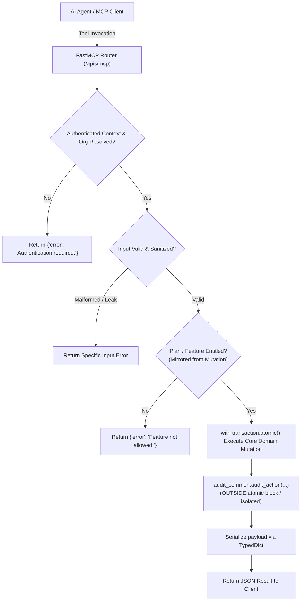

# Ostorlab FastMCP Tool & API Development Guide

Standard operating procedure, design patterns, testing standards, and anti-pitfall guide for developing production-grade Model Context Protocol (MCP) tools within the Ostorlab ecosystem and `ogle_reporting_engine`.

---

## 🧭 Architecture & Request Lifecycle

```text
┌────────────────────────────────────────────────────────────────────────────────────────┐
│                          FastMCP Tool Execution Lifecycle                              │
├────────────────────────────────────────────────────────────────────────────────────────┤
│  1. FastMCP Dispatch      ───▶  SSE / Streamable HTTP endpoint (`/apis/mcp/`)         │
│                                                                                        │
│  2. Import Isolation      ───▶  Independent `try/except ImportError` per tool module   │
│                                                                                        │
│  3. Context & Auth        ───▶  Resolve caller session & extract `organisation`       │
│                                                                                        │
│  4. Validation & Sanitization ▶ Scrub URL credentials, validate bounds (< 512 chars)  │
│                                                                                        │
│  5. Atomic Mutation       ───▶  `with transaction.atomic()` (Domain write only)       │
│                                                                                        │
│  6. Decoupled Audit Log   ───▶  `audit_common.audit_action` OUTSIDE atomic block       │
│                                                                                        │
│  7. Serialized Response   ───▶  Structured TypedDict or descriptive error dict        │
└────────────────────────────────────────────────────────────────────────────────────────┘
```



---

## 📐 1. Consistent API Design Conventions

### Tool Naming Standards
Follow standard snake_case CRUD verbs:
- **`list_<entities>`**: Paginated listing with filtering (`list_scans`, `list_api_keys`, `list_schedule_rules`).
- **`get_<entity>`**: Single entity retrieval by ID or unique key (`get_vulnerability`, `get_saml_config`).
- **`create_<entity>`**: Resource creation (`create_scanner`, `create_servicenow_ticket_map`).
- **`update_<entity>`**: Partial or full resource mutation (`update_scanner_group`, `update_saml`).
- **`delete_<entity>`**: Resource removal or deactivation (`delete_scanner`, `delete_jira_ticket_map`).

### Parameter & Schema Contracts
- **Nullable vs. Omitted vs. Empty String**:
  - `param: str | None = None` means **omit / do not alter**.
  - `param: str = ""` explicitly means **clear / empty value**.
  - Document this contract in the tool's public docstring so LLMs know how to trigger partial updates.
- **Typed Input Annotations**: Every tool argument must have explicit Python type annotations (`str`, `int`, `bool`, `list[str]`, `dict`).

### Response Payloads
- **Success Responses**: Return plain dictionaries conforming to a `TypedDict` serializer definition (e.g. `{"id": 123, "name": "...", "status": "active"}`).
- **Error Responses**: Return a dictionary with an `error` key containing a human-readable, specific error message:
  ```python
  {"error": "Instance URL host could not be resolved via DNS."}
  ```

### Deterministic Pagination
When implementing list tools with cursor or offset pagination:
- **Always use composite tie-breakers**: Never order by timestamp alone (`-created_at`). Always append primary key ordering to guarantee stable pages:
  ```python
  queryset = queryset.order_by("-created_at", "-id")
  ```

---

## ⚠️ 2. The 7 Golden Rules (Common Pitfall Prevention)

### Rule 1: Strict GraphQL Parity
> [!IMPORTANT]
> **Never invent independent permission gates on MCP tools alone.**
> MCP tools must strictly mirror the authorization, plan entitlement checks (`subscriptions.common.features.is_feature_allowed`), and validation rules of the underlying GraphQL mutations. If a rule belongs in the platform, enforce it in the shared mutation/service layer first.

### Rule 2: Transaction & Audit Isolation
> [!WARNING]
> **Never put `audit_common.audit_action()` inside a `transaction.atomic()` block.**
> Audit logging is an operational observer. A transient audit database failure or validation error should never abort or roll back a successful primary business transaction.
> ```python
> # ❌ BAD: Audit failure rolls back user creation
> with transaction.atomic():
>     scanner = Scanner.objects.create(...)
>     audit_common.audit_action(...)
> 
> # ✅ GOOD: Isolated execution
> with transaction.atomic():
>     scanner = Scanner.objects.create(...)
> 
> try:
>     audit_common.audit_action(...)
> except Exception as e:
>     logger.warning(f"Audit logging failed: {e}")
> ```

### Rule 3: Isolated Import Guards in `mcp.py`
> [!CAUTION]
> **One tool per `try/except ImportError` block.**
> Never group multiple tool imports together in `reporting_engine/mcp_server/mcp.py`. If one tool has a missing optional dependency, grouping them will cause all sibling tools in that block to silently fail registration.
> ```python
> # ✅ GOOD: Isolated registration
> try:
>     from reporting_engine.integrations.mcp_toolset.tools import create_scanner
>     mcp.add_tool(create_scanner.create_scanner)
> except ImportError:
>     pass
> 
> try:
>     from reporting_engine.integrations.mcp_toolset.tools import update_scanner
>     mcp.add_tool(update_scanner.update_scanner)
> except ImportError:
>     pass
> ```

### Rule 4: Exception Handling Precision (Never Swallow IntegrityErrors)
> [!WARNING]
> Do not catch generic `django.db.utils.IntegrityError` and blindly assume it was a duplicate key.
> `IntegrityError` also fires on foreign key constraints (e.g. deleted organization) and null violations. Inspect the exception args or check for existence first.

### Rule 5: Specific Error Messages (DNS vs Syntax)
> Differentiate between malformed input syntax (e.g., `Invalid URL format`) and external runtime connectivity failures (`CouldNotResolveUrlError` or connection timeouts). Giving distinct errors prevents users/agents from trying to rewrite valid syntax when the network is unreachable.

### Rule 6: Credential & Secret Sanitization
> - **Scrub embedded userinfo**: Strip `user:password@` from URLs prior to saving and logging.
> - **Defensive Masking**: Mask secrets (`mask_api_key(key)`) only when a secret string exists. Do not pass `None` or empty strings to maskers to prevent emitting false-positive `*******` strings in audit logs.

### Rule 7: Strict Validation Boundaries
> Validate string length bounds (e.g., instance URLs `<= 512` characters) in the tool before executing database queries to prevent database `DataError` crashes.

---

## 🛠️ 3. Canonical MCP Tool Template

Use this reference structure when creating new FastMCP tools in `reporting_engine/integrations/mcp_toolset/tools/`:

```python
"""FastMCP tool for creating standard Git integrations."""

from typing import Any, TypedDict
import logging
import urllib.parse
from django.db import transaction, IntegrityError

from reporting_engine.common import audit_common
from reporting_engine.integrations.models import StandardGitIntegrationConfiguration
from reporting_engine.mcp_server.auth import get_organisation_from_context

logger = logging.getLogger(__name__)

_MAX_URL_LENGTH = 512


class GitIntegrationDict(TypedDict):
    id: int
    instance_url: str
    is_active: bool


def create_standard_git_integration(
    instance_url: str,
    api_token: str | None = None,
    context: dict[str, Any] | None = None,
) -> dict[str, Any]:
    """Create a standard Git integration configuration for an organisation.

    Args:
        instance_url: Base HTTPS URL of the Git instance (max 512 characters).
        api_token: Optional personal access token or API key.
        context: MCP request context containing authentication state.

    Returns:
        Dictionary with serialized integration data or error details.
    """
    organisation = get_organisation_from_context(context)
    if organisation is None:
        return {"error": "Authentication required. Could not resolve organisation context."}

    # 1. Validation & sanitization
    clean_url = instance_url.strip()
    if len(clean_url) > _MAX_URL_LENGTH:
        return {"error": f"Instance URL provided exceeds max length of {_MAX_URL_LENGTH} characters."}

    parsed = urllib.parse.urlparse(clean_url)
    if parsed.scheme not in ("http", "https") or not parsed.netloc:
        return {"error": "Instance URL provided is invalid. Must include http or https protocol."}

    if parsed.username or parsed.password:
        return {"error": "Instance URL must not contain embedded user credentials."}

    # 2. Check duplicates
    if StandardGitIntegrationConfiguration.objects.filter(
        organisation=organisation, instance_url=clean_url
    ).exists():
        return {"error": "An integration with this instance URL already exists for the organisation."}

    # 3. Core mutation in atomic transaction
    try:
        with transaction.atomic():
            integration = StandardGitIntegrationConfiguration.objects.create(
                organisation=organisation,
                instance_url=clean_url,
                api_token=api_token or "",
            )
    except IntegrityError:
        return {"error": "Failed to create integration due to a database integrity constraint."}
    except Exception as e:
        logger.exception("Failed to create standard git integration")
        return {"error": f"Unexpected error while creating integration: {str(e)}"}

    # 4. Decoupled audit logging
    try:
        audit_common.audit_action(
            organisation=organisation,
            action="CREATE_STANDARD_GIT_INTEGRATION",
            metadata={"instance_url": clean_url, "integration_id": integration.id},
        )
    except Exception as audit_err:
        logger.warning("Audit logging failed for integration creation: %s", audit_err)

    # 5. Serialize response
    return {
        "id": integration.id,
        "instance_url": integration.instance_url,
        "is_active": integration.is_active,
    }
```

---

## 🧪 4. Testing & Verification Checklist

When writing unit tests (`tests/mcp_tools/test_<tool_name>.py`):

- [ ] **Happy Path**: Successfully execute tool with valid input and verify DB row and returned payload.
- [ ] **Authentication Guard**: Verify unauthenticated context returns error dict.
- [ ] **Sanitization & Edge Cases**: Test URLs with embedded userinfo (`user:pass@host`) are rejected.
- [ ] **Overlong Input Boundary**: Pass string of length > max limit (e.g. 513 chars) and verify clean validation error.
- [ ] **Duplicate Conflict**: Verify duplicate check returns clear existing error without raising unhandled `IntegrityError`.
- [ ] **Audit Log Decoupling**: Test that an exception raised by `audit_action` does not roll back the database transaction.
- [ ] **Isolated Import in `mcp.py`**: Verify tool is registered in its own single `try/except ImportError` block.
