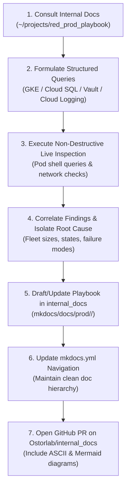

# Production Investigation & Operational Runbook Protocol

This skill governs how agents investigate production anomalies, scanner fleet capacity bottlenecks, and infrastructure incidents across Ostorlab's systems.

---

## ⚡ The Two Golden Rules of Production Investigation

> [!IMPORTANT]
> ### 1. Internal Documentation First
> Before formulating speculative hypotheses, running random scripts, or modifying production state, the agent **MUST ALWAYS** consult the existing internal documentation in:
> - Local repository: `~/projects/red_prod_playbook`
> - Agent plugin: `~/.config/agent-skills/shared-agent-skills/plugins/internal-docs/mkdocs/docs/prod/`
> - Remote repository: `https://github.com/Ostorlab/internal_docs.git`

> [!IMPORTANT]
> ### 2. Mandatory Post-Investigation PR
> Following **ANY** production investigation, incident triage, or debugging session:
> - The agent **MUST NEVER** end the session without documenting the findings.
> - The agent **MUST** update existing playbooks or author a new playbook under `mkdocs/docs/prod/`.
> - If a new playbook is added, the agent **MUST** register it in `mkdocs.yml`.
> - The agent **MUST** push a feature branch (`docs/<feature>-playbook`) and open a Pull Request against `Ostorlab/internal_docs` on GitHub.

---

## 🧭 Investigation Workflow

```text
┌────────────────────────────────────────────────────────────────────────────────────────┐
│                        Production Investigation Lifecycle                              │
│                                                                                        │
│  ┌────────────────────────┐         ┌────────────────────────┐                         │
│  │ 1. Read Internal Docs  │ ──────► │ 2. Identify Architecture│                        │
│  │ Check mkdocs/docs/prod │         │ Verify models, pools,  │                         │
│  │ for matching runbooks  │         │ endpoints, and secrets │                         │
│  └────────────────────────┘         └───────────┬────────────┘                         │
│                                                 │                                      │
│                                                 ▼                                      │
│  ┌────────────────────────┐         ┌────────────────────────┐                         │
│  │ 4. Formulate Evidence  │ ◄────── │ 3. Inspect Live State  │                         │
│  │ Synthesize root cause  │         │ Query GKE pods, DB,    │                         │
│  │ with concrete metrics  │         │ Vault, Cloud Logging   │                         │
│  └──────────┬─────────────┘         └────────────────────────┘                         │
│             │                                                                          │
│             ▼                                                                          │
│  ┌────────────────────────┐         ┌────────────────────────┐                         │
│  │ 5. Author New Playbook │ ──────► │ 6. Open GitHub PR      │                         │
│  │ Update internal_docs   │         │ gh pr create with flow │                         │
│  │ with triage & recovery │         │ & architecture diagram │                         │
│  └────────────────────────┘         └────────────────────────┘                         │
└────────────────────────────────────────────────────────────────────────────────────────┘
```



---

## 🛠️ Production Investigation Toolset

### 1. Kubernetes & Pod Inspection
- Identify active cluster:
  ```bash
  kubectl cluster-info
  kubectl get pods -A
  ```
- Target core services in namespace `default`:
  - `reporting-engine`: Vulnerability management, orgs, user access, scanner registry.
  - `scanning-engine`: Scan orchestrator, queue dispatcher, scan state machine.
  - `scan-persistence-worker`: Async event ingestion into Cloud SQL.
  - `prometheus-server`: Real-time node and container metric scraping.
  - `vault`: Secrets and SSH OTP generation.

### 2. Live Database Inspection via Pod Shells
Always query running state using `python manage.py shell -c`:
```bash
# Check scan queue health
kubectl exec deployment/scanning-engine -n default -- python manage.py shell -c "
from orchestrator.models import Scan
print('In Progress:', Scan.objects.filter(progress='in_progress').count())
print('Locked:     ', Scan.objects.filter(progress='locked').count())
print('Pending:    ', Scan.objects.filter(progress='not_started').count())
"
```

### 3. Scanner Host Reachability
Ostorlab bare-metal and VPS scanners use dedicated Vault SSH:
- Port 22 is disabled/closed by default.
- Port 8022 is the active Vault OTP SSH daemon.
- Test port reachability:
  ```bash
  nc -zv -w 2 <hostname>.ostorlab.app 8022
  ```

---

## 📝 The Post-Investigation PR Protocol

Once an investigation is concluded and the root cause is established:

```bash
# 1. Navigate to internal_docs local checkout
cd ~/projects/red_prod_playbook

# 2. Sync with main
git checkout main
git pull origin main

# 3. Create a dedicated documentation branch
git checkout -b docs/<incident-or-feature>-playbook

# 4. Author the markdown playbook under mkdocs/docs/prod/<category>/
# Include: Architecture, ASCII Flow Diagram, Step-by-Step Triage, and Recovery Commands.

# 5. Add the new file to mkdocs.yml under the matching navigation section

# 6. Commit following Conventional Commits
git add mkdocs.yml mkdocs/docs/prod/...
git commit -m "docs(<scope>): add <topic> playbook"

# 7. Push branch and open Pull Request
git push -u origin docs/<incident-or-feature>-playbook
gh pr create --repo Ostorlab/internal_docs \
  --title "docs(<scope>): add <topic> playbook" \
  --body "..."
```
