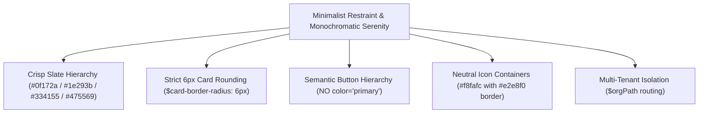

# Ostorlab Reporting Engine Frontend UI & Consistency Guide

Canonical guide for designing, implementing, refactoring, and verifying UI components and views across the Ostorlab Reporting Engine (`reporting_engine_frontend`).

---

## 1. Core Design Philosophy & Aesthetic Constraints

The Ostorlab Reporting Engine interface is an **operational command center** for security engineers, SOC analysts, and DevSecOps teams. It balances high information density with refined Apple / Steve Jobs-inspired minimalism:



### 1.1 Steve Jobs / Apple Minimalist Philosophy & Visual Restraint
1. **Monochromatic Serenity**: The canvas is crisp white (`#ffffff`) and subtle slates (`#f8fafc`, `#f1f5f9`) bounded by hairline 1px `#e2e8f0` borders.
2. **Color as Intent, Never Decoration**: Saturated color is reserved strictly for meaningful status indicators (`success`, `warning`, `error`, `accent`) and primary user actions.
3. **No Rainbow Pastel Avatars**: Never use multicolored pastel avatar circles behind every field or switch. All icon containers use neutral `#f8fafc` surfaces with `#e2e8f0` borders and `grey-darken-3` icons.
4. **Unclutter the UI**: Strip gratuitous badges, noisy border dividers, redundant cards, and extraneous visual decorations.

### 1.2 Strict Card Geometry & Border Radius
- **Standard Card Border Radius**: Strictly **`6px` (`rounded-md` / `.rounded-md`) / max `8px` (`rounded-lg`)**.
- **Card SCSS Token**: `$card-border-radius: 6px;` (`rounded="md"`).
- **Forbidden**: Never use oversized rounding (`rounded-xl`, `rounded-2xl`, `16px+`) on cards, panels, or dialog surfaces.

---

## 2. Master Button Architecture & Semantic Color Rules

> [!IMPORTANT]
> **MANDATORY BUTTON RULES:**
> 1. **No `primary` Color for Buttons**: Never use `color="primary"` on action buttons.
> 2. **Main Action Buttons**: MUST use `variant="elevated"`:
>    - **Success Actions** (Save, Update, Confirm, Submit, Verify, Create): `color="success"`
>    - **Neutral Main Actions** (Filter, Connect, View, Add): `color="accent"`
>    - **Destructive Actions** (Delete, Archive, Revoke, Remove): `color="error"`
> 3. **Secondary Action Buttons**: MUST use `variant="outlined"` (`color="grey-darken-3"` or neutral).
> 4. **Cancel & Clear Buttons**: MUST use `<UiButton intent="cancel" size="small">` or `variant="outlined"` with neutral tones (`color="grey-darken-1"`). Avoid vibrant or saturated colors for dismissive/cancel actions. Never use raw compact Vuetify buttons with `rounded="md"` which collapse vertical padding and distort into oval pills.
> 5. **Ghost Actions**: MUST use `variant="text"` (`color="grey-darken-3"`).
> 6. **Consistent Geometry & Border Radius**: Standard button border radius is strictly **`6px` (`rounded-md`) / max `8px` (`rounded-lg`)**. Buttons within the same toolbar must have matching geometry — **NEVER mix circular (`50%`) icon buttons with rectangular buttons in the same toolbar**.
> 7. **Vue 3 SFC Scoped CSS on Root Elements**: In `<style scoped>`, `:deep(.v-btn--icon)` compiles to `[data-v-xxxx] .v-btn--icon` and will NOT match the root `<v-btn>` element. Always target the root directly: `.v-btn.v-btn--icon { border-radius: 6px !important; }`.
> 8. **Crisp Toolbar Dividers**: Use an explicit `<div class="toolbar-divider" />` (`width: 1px; height: 24px; background: #cbd5e1; margin: 0 4px;`) instead of `<v-divider vertical>` which collapses due to Vuetify flex/opacity defaults.
> 9. **Concise Modal & Form Action Labels**: Action buttons in modals and forms MUST use concise action verbs (e.g. `Save`, `Create`, `Update`, `Delete`). **NEVER use verbose phrasing like `Save Changes` on modals or form submissions — always use `Save`.**

### Button Variants & Geometries Matrix

| Variant | Variant Type | Dimensions | Border Radius | Color / Background | Border | Typography |
| :--- | :--- | :--- | :--- | :--- | :--- | :--- |
| **Main Success Action** (`Save`, `Update`, `Start Scan`) | `variant="elevated"` | Height: `36-40px`<br>Pad: `8px 16px` | **`6px`** (`rounded-md`) / `8px` | `color="success"` | None | `13.5px`, Bold `700`, `#ffffff` |
| **Main Neutral Action** (`Filter`, `Connect`, `Add`) | `variant="elevated"` | Height: `36-40px`<br>Pad: `8px 16px` | **`6px`** (`rounded-md`) / `8px` | `color="accent"` | None | `13.5px`, Bold `700`, `#ffffff` |
| **Destructive Action** (`Delete`, `Revoke`) | `variant="elevated"` | Height: `36-40px`<br>Pad: `8px 16px` | **`6px`** (`rounded-md`) / `8px` | `color="error"` | None | `13.5px`, Bold `700`, `#ffffff` |
| **Secondary Action** (`Configure`, `Export CSV`) | `<UiButton intent="secondary">` | Height: `32-36px`<br>Pad: `6px 14px` | **`6px`** (`rounded-md`) / `8px` | `color="grey-darken-3"` | `1px solid #cbd5e1` | `12.5px`, Semi-bold `600` |
| **Cancel / Reset / Clear Filter** (`Cancel`, `Clear`) | `<UiButton intent="cancel">` | Height: `30-32px`<br>Pad: `0 12px` | **`6px`** (`rounded-md`) / `8px` | `#ffffff` (Hover: `#f8fafc`) | `1px solid #cbd5e1` (Hover: `#94a3b8`) | `12.5px`, Medium `500` |
| **Toolbar Square Icon Button** (`Share`, `Refresh`, `Archive`) | `intent="secondary"` / `outlined` | `36x36px` (or `32x32px`) | **`6px`** (`rounded-md`) | `background: #ffffff` | `1px solid #cbd5e1` | Icon: `20px`, `#475569` |
| **Hero / Feature CTA** (`Explore →`, `New Scan`) | `variant="elevated"` | Height: `24-28px`<br>Pad: `4px 12px` | **`4px`** (`rounded`) | `color="secondary"` (or `#d9534f`) | None | `11-13px`, Bold `700`, `#ffffff` |
| **Plan Upgrade Capsule** (`Unlock Full Coverage ⌵`) | `variant="elevated"` | Height: `32px`<br>Pad: `6px 14px` | **`9999px`** (`rounded-pill`) | `color="accent"` | None | `12px`, Bold `700`, `#ffffff` |
| **Segmented Mode Pill** (`Cockpit`, `Focus`, `Recs`) | Segmented | Height: `28px`<br>Pad: `4px 12px` | **`9999px`** (`rounded-pill`) | Active: `#ffffff`<br>Inactive: `transparent` | Active: `elevation 1`<br>Inactive: None | Active: `13px`, Bold `700`<br>Inactive: `13px`, Medium `500` |
| **Drawer Nav Row Item** (`Dashboard`, `Threat Center`) | Nav Item | Height: `34px`<br>Pad: `7px 10px` | Normal: **`6px`**<br>Active: **`6px`** | Normal: `transparent`<br>Active: `#e0f2fe` | Normal: None<br>Active: **`4px solid #0081ba`** | Normal: `13.5px`, Medium `500`<br>Active: `13.5px`, Bold `700` |
| **Ghost Icon Button** (Close `[X]`, Cog `[⚙️]`) | `variant="text"` | `32x32px` or `36x36px` | **`6px`** (`rounded`) | `transparent` | None | Icon: `18-20px`, `#475569` |

---

## 3. Dropdown Menus & Action Lists Specification

Dropdown menus (e.g. Export, PDF Reports, Action Menus, Context Popovers) must follow strict Apple-grade minimalism, clear typography hierarchy, and informative iconography:

```
┌─────────────────────────────────────────────────────────────────────────────┐
│                           DROPDOWN MENU ARCHITECTURE                        │
│                                                                             │
│  <v-menu location="bottom end" :offset="6">                                 │
│  ┌───────────────────────────────────────────────────────────────────────┐  │
│  │  📄   Full Report                                                     │  │
│  │       Report with technical details of all findings                   │  │
│  │                                                                       │  │
│  │  📊   Executive Summary                                               │  │
│  │       Report with executive summary section only                      │  │
│  │                                                                       │  │
│  │  🛡️   Standards Compliance Report                                     │  │
│  │       Report with scan standards compliance                           │  │
│  └───────────────────────────────────────────────────────────────────────┘  │
└─────────────────────────────────────────────────────────────────────────────┘
```

### 3.1 Dropdown Container Rules
- **Border Radius**: Strictly **`6px` (`rounded-md`) / `8px` (`rounded-lg`)**. Never sharp 0px or oversized 16px+.
- **Border**: Crisp hairline `1px solid #e2e8f0`.
- **Soft Ambient Elevation**: `elevation-4` with soft diffused shadow (`box-shadow: 0 10px 25px -5px rgba(0,0,0,0.08), 0 8px 10px -6px rgba(0,0,0,0.04) !important`).
- **Menu Padding**: Compact `pa-1.5` padding around the list container.
- **Offset**: Set `:offset="6"` on `<v-menu>` to maintain an elegant 6px floating gap from the trigger button.
- **Menu Width**: `min-width: 300px` to `340px` when items include descriptive subtitles to prevent awkward word truncation.

### 3.2 Action Item Row Anatomy
- **Row Padding**: `px-3 py-2` (or `py-2.5` for two-line items).
- **Row Geometry**: `rounded-md` (6px radius) with `mb-1` margin between items.
- **Hover Microinteraction**: Seamless background transition (`transition: background-color 0.15s ease`) switching to `#f8fafc` on hover (or `#f1f5f9` on active/focus).

### 3.3 Unboxed Semantic Iconography
- **Clean Unboxed Icons**: Do NOT place heavy borders, square boxes, or prison cells around icons in dropdown menus. Let the icon breathe naturally alongside the text with clean optical alignment (`align-start`, `mt-0.5`).
- **Icon Sizing & Color**: 20px icon, color `grey-darken-3` (`#334155` / `#475569`).
- **Distinct Semantic Iconography**:
  - **NEVER repeat the same icon for different options** (e.g. do not repeat a generic PDF icon 4 times in a PDF menu).
  - Use distinct semantic icons matching the action:
    - *Full Report / Detailed Findings*: `mdi-file-document-outline`
    - *Executive Summary / Metrics*: `mdi-chart-box-outline`
    - *Standards / Compliance*: `mdi-shield-check-outline`
    - *Agentic Deep Scan / AI Analysis*: `mdi-robot-outline`
    - *Export Archive (ZIP)*: `mdi-folder-zip-outline`
    - *Export CSV*: `mdi-file-delimited-outline`
    - *Export SARIF (Code/JSON)*: `mdi-code-json`

### 3.4 Two-Line Typography Hierarchy
- **Primary Title**: High-contrast bold `text-body-2 font-weight-bold text-grey-darken-4` (`#0f172a` / `#1e293b`), `mb-0.5`.
- **Secondary Subtitle**: Clear, readable `text-caption text-grey-darken-2` (`#475569` / `#64748b`) with line height `1.35` (avoid washed-out faint grey).

### 3.5 Canonical Dropdown Menu Template

```vue
<v-menu location="bottom end" :offset="6">
  <template #activator="{ props }">
    <UiButton
      v-bind="props"
      intent="secondary"
      prepend-icon="mdi-file-pdf-box"
      append-icon="mdi-chevron-down"
    >
      {{ $t('common.pdf') }}
    </UiButton>
  </template>
  <v-list density="compact" min-width="340" class="scan-dropdown-menu rounded-md border pa-1.5 elevation-4 bg-white">
    <v-list-item
      v-for="(item, index) in itemsPdf"
      :key="index"
      class="scan-dropdown-item rounded-md px-3 py-2 mb-1"
      @click="item.action"
    >
      <div class="d-flex align-start ga-3 py-1">
        <v-icon size="20" color="grey-darken-3" class="flex-shrink-0 mt-0.5">{{ item.icon }}</v-icon>
        <div class="min-w-0 flex-grow-1">
          <v-list-item-title class="font-weight-bold text-body-2 text-grey-darken-4 text-truncate mb-0.5">
            {{ item.title }}
          </v-list-item-title>
          <v-list-item-subtitle class="text-caption text-grey-darken-2" style="line-height: 1.35;">
            {{ item.subtitle }}
          </v-list-item-subtitle>
        </div>
      </div>
    </v-list-item>
  </v-list>
</v-menu>
```

---

## 4. Shared UI Components Catalog (`@/components/ui`)

Always prefer importing canonical components from `@/components/ui`:

```typescript
import {
  // Buttons
  UiButton,
  // Cards & Containers
  UiCard,
  UiBannerHero,
  // Headers
  UiPageHeader,
  UiSectionHeader,
  // Controls
  UiSegmentedControl,
  UiSettingRow,
  // Badges & Status
  UiSeverityBadge,
  UiStatusChip,
  // Feedback
  UiEmptyState,
  UiAlert,
  UiCopyButton,
  // Metrics
  UiKpiCard,
  // Modals & Dialogs
  UiModal,
  UiConfirmModal,
  UiLoadingDialog
} from '@/components/ui'
```

### Component Quick Reference & Usage Patterns

```
┌────────────────────────────────────────────────────────────────────────────────────────┐
│ COMPONENT CATALOG OVERVIEW                                                             │
├─────────────────────┬──────────────────────────────────────────────────────────────────┤
│ UiButton            │ Semantic button with intent (success, neutral, danger, cancel)  │
│ UiCard              │ 6px container with title, subtitle, icon, header-actions, footer │
│ UiBannerHero        │ Eye-catching announcement banner with watermark icon and CTAs    │
│ UiPageHeader        │ Top page banner with 44px neutral icon avatar, title, & actions  │
│ UiSectionHeader     │ Sub-section divider with title, count badge, and actions         │
│ UiSegmentedControl  │ 9999px pill toggle group for 2-5 view modes                      │
│ UiSettingRow        │ Monochromatic configuration row with icon, label, and control    │
│ UiSeverityBadge     │ Vulnerability severity chip (CRITICAL, HIGH, MEDIUM, LOW, INFO)  │
│ UiStatusChip        │ Lifecycle chip (CONFIRMED, ACTIVE, PENDING, FAILED, etc.)        │
│ UiEmptyState        │ Dashed 1px container with 44px avatar, title, text, and CTA      │
│ UiAlert             │ Subtle monochromatic inline alert banner with closable option    │
│ UiCopyButton        │ 1-click clipboard copy with tooltip and checkmark feedback       │
│ UiKpiCard           │ Posture KPI metric card with trend delta and status icon         │
│ UiModal             │ Standard 6px dialog with sticky header, scroll body, & footer    │
│ UiConfirmModal      │ Semantic confirmation modal (danger, success, neutral)           │
│ UiLoadingDialog     │ Minimalist monochromatic progress dialog for blocking tasks      │
└─────────────────────┴──────────────────────────────────────────────────────────────────┘
```

---

## 5. Key Shell & Layout Components

### 5.1 Top Application Bar (`AppBar.vue`) & Organisation Selector
- **Height**: Fixed 56px sticky top bar, elevation 0 with bottom border `1px solid #e2e8f0`.
- **Organisation Dropdown (`OrganisationDropdown.vue`)**:
  - Menu width: `360px`, `rounded-md` (6px radius), soft ambient shadow.
  - No redundant pinned "Current Org" block; search input sits cleanly at top with autofocus.
  - **Single-Line Row (`OrganisationItemRow.vue`)**: Uniform 38px row height, 26×26px monochromatic slate fallback avatar (`#334155`) with white uppercase letter, active green checkmark (`mdi-check` in `#16a34a`), and keyboard highlight indicator (`mdi-keyboard-return`).

### 5.2 Sidebar Navigation Drawer (`Drawer.vue`)
- **Geometry**: Strict fixed `320px` width (`:width="320"`), `z-index: 9999`, full height `100vh`.
- **Search Box**: Light slate fill (`#f8fafc`), 1.5px border (`#e2e8f0`), rounded `8px`, dynamic platform shortcut `/`.
- **Accordion Tree**: Clean spatial indentation (`margin-left: 12px`, `padding-left: 4px`) without noisy vertical guide borders.
- **Active Navigation Item**:
  - Soft cyan background `#e0f2fe`.
  - Solid **4px vertical left accent bar** `#0081ba`.
  - Deep navy bold text `#005a82` (`font-weight: 700`).
  - Active icon `#0081ba`.
- **Live Active Scan Dot**: When a scan is running, renders an 8×8px pulsating emerald dot (`#10b981`) next to the Scanning menu item.
- **Pinned Footer**:
  - **Ask Copilot Card**: Full width card, background `#f8fafc`, 1.5px border `#cbd5e1`, 8px radius, dark blue gradient glow orb (`.copilot-glow-orb`) with white sparkles icon, dynamic platform badge (`⌘J` / `Ctrl+J`).
  - **User Profile Card**: Fixed 36×36px circular avatar (`flex-shrink: 0`), user display name (`13px` bold `#0f172a`), truncated email (`11.5px` `#64748b`), and gear button routing to `$orgPath('/account/profile')`.

### 5.3 Posture Command Center (`ModernSecurityDashboard.vue`)
- **Mode Switcher Bar**: 9999px pill group (`Cockpit`, `Focus`, `Recommendations`), height 28px, background `#f1f5f9`.
- **Posture Pulse Hero (`PosturePulseHero.vue`)**: Unified 6px white card with 4 telemetry columns:
  1. `FIXED (30 DAYS)`: Green velocity count (`18 / >0 target`).
  2. `CRITICAL & HIGH`: Neutral inventory volume (`42 / Active`).
  3. `SLA BREACHES`: Action health priority (`2 / <5 target`).
  4. `REMEDIATION MTTR`: Velocity indicator (`11.4d / <14d target`).

---

## 6. Architectural & Implementation Rules

### 6.1 Multi-Tenant Route Scoping Contract (`$orgPath`)
All internal links, router pushes, and `:to` attributes **MUST** pass through `$orgPath(...)` to preserve the active organization workspace context:

```vue
<!-- ✅ CORRECT: Preserves multi-tenant organization context -->
<NuxtLink :to="$orgPath('/dashboard/posture')">Dashboard</NuxtLink>
<v-btn :to="$orgPath('/remediation/tickets')">View Tickets</v-btn>

<!-- ❌ INCORRECT: Causes tenant reset and workspace detachment -->
<NuxtLink to="/dashboard/posture">Dashboard</NuxtLink>
<v-btn to="/remediation/tickets">View Tickets</v-btn>
```

### 6.2 Composable Unwrapping & Reactivity
Always unwrap `ComputedRef` instances returned by composables inside derived computed properties. Never store the ref object directly into another `ref`:

```typescript
// ✅ CORRECT: Unwrapped value inside derived computed
const currentUser = computed(() => {
  return orgComposable?.user?.value || store.value?.state?.organisation?.user || null
})

// ❌ INCORRECT: Stores ComputedRef object, losing reactivity
const composableUser = ref(orgComposable.user)
```

### 6.3 Route Segment Boundaries
When determining if a route or menu item is active, match against resolved segment boundaries to prevent false positive partial matches:

```typescript
// ✅ CORRECT: Segment-safe boundary matching
const isItemActive = (to?: string) => {
  if (!to) return false
  const currentPath = route?.path || ''
  const resolved = $orgPath(to)
  return currentPath === resolved || currentPath.startsWith(resolved + '/')
}
```

### 6.4 Meaningful Empty States & Zero Layout Shifts
1. **Empty States**: Every chart and table must render a structured empty state (`UiEmptyState` or 44px avatar + bold title + caption + outlined CTA button inside 1px dashed `#fafbfc` container).
2. **Skeleton Loaders**: Async data fetches must render content-shaped `<v-skeleton-loader>` blocks rather than blank screens to eliminate Cumulative Layout Shift (CLS).

### 6.5 100% Internationalization (i18n)
- **Zero raw user-facing strings**: All labels, tooltips, placeholders, and error messages must use `$t(...)`.
- Every translation key added must exist in all 5 supported locale files (`en`, `es`, `fr`, `ja`, `zh`).
- Verify with `npm run i18n:scan`.

### 6.6 Nuxt 3 Page Layout Contract (`layout: 'dashboard'`)
All organization-scoped views under `pages/o/[org]/` **MUST** explicitly specify `definePageMeta({ layout: 'dashboard' })`:
```typescript
definePageMeta({
  layout: 'dashboard'
})
```
*Failure to specify this causes Nuxt to fall back to `default.vue`, rendering pages without the top AppBar (`DashboardCoreAppBar`) and left sidebar Navigation Drawer (`DashboardCoreDrawer`).*

### 6.7 Standard Page Anatomy & Data Table Architecture
Canonical reference: `pages/o/[org]/integrations/api.vue`.

1. **Page Container & Spacing**:
   - Page root: `<div class="[page-name]-page py-4 px-2 px-md-4">`
   - Spacing: Standard `mb-4` margins between `Breadcrumbs`, `UiPageHeader`, Filter/Search Toolbar card, and Table card.
2. **Filter & Search Toolbar Card**:
   - `<v-card variant="flat" class="rounded-md border pa-3 mb-4 bg-grey-lighten-5">`
   - Contains a search `v-text-field` (`max-width: 360px`, `clearable`), filter controls (`UiSegmentedControl` / `v-select`), clear filters button, and action buttons.
3. **Data Table Container**:
   - `<UiCard no-padding class="overflow-hidden mb-4">` wrapping `<v-data-table>` or `<v-data-table-server>`.
   - Hover transition: `tr.table-row:hover { background-color: #f8fafc; }`.
   - Neutral icon boxes: `32×32px` (`#f8fafc` bg, `#e2e8f0` border, `rounded-md`).
   - High contrast typography: `text-body-2 font-weight-bold text-grey-darken-4`.
   - Action buttons: `<td class="py-3 px-4 text-end">` with compact icon buttons and tooltips.
   - `#no-data` slot populated with `UiEmptyState`.
4. **Dedicated Full Pages for Feeds & Audit Logs**:
   - Feeds, notifications, and logs must use dedicated full pages (e.g. `/o/:org/notifications`) rather than modals. Dropdowns provide a compact top-5 preview and route to the dedicated page on "View all".

### 6.8 Multi-Segment Execution Progress Strips & Async Status Polling
Canonical reference: `components/ide/agenticDeepScanAnalysis/RiskProgressStrip.vue`.

```text
┌─────────────────────────────────────────────────────────────────────────────┐
│ 75% Completed  •  3 of 4 Analyzed                   [✖ Clear Status Filter] │
│ ┌──────────────┬──────────────────┬───────────────┬───────────────────────┐ │
│ │  Done (50%)  │ In Progress(25%) │  Error (0%)   │     Queued (25%)      │ │
│ └──────────────┴──────────────────┴───────────────┴───────────────────────┘ │
│ [✔ Done: 2]   [↻ In Progress: 1 (pulse)]   [⚠ Errors: 0]   [◷ Queued: 1]    │
└─────────────────────────────────────────────────────────────────────────────┘
```

1. **Card Container & Spacing**:
   - Encapsulated in `<v-card variant="flat" class="rounded-md border bg-white pa-4 mb-4">`.
2. **Header Spatial Rhythm**:
   - Left: Headline metrics with strong typographic contrast (`text-body-2 font-weight-bold text-grey-darken-4` for percentage, `text-caption text-grey-darken-2 font-weight-medium` for count).
   - Right: Clean contextual reset button `<UiButton v-if="modelValue !== 'all'" intent="cancel" size="small" prepend-icon="mdi-close-circle-outline">`.
3. **Multi-Segment Visual Track**:
   - Height: Standard 8px (`height: 8px; border-radius: 6px; background-color: #e2e8f0;`).
   - Semantic color segments with tooltips: Done (`#16a34a`), In Progress (`#f59e0b`), Errors (`#dc2626`), Queued (`#94a3b8`).
4. **Interactive Status Filter Chips**:
   - Status chips below the track allow one-click filtering and toggle back to 'all' on second click.
   - Active state: highlighted with distinct border and semi-bold weight.
   - In-progress pulse: Active scan states display a subtle animated radar ring (`@keyframes pulse-ring`).
5. **Quiet Background Polling & Race-Condition Immunity**:
   - Never show full table loading spinners during background polling (`showSpinner = false`).
   - Guard concurrent async requests with a monotonic sequence counter (`requestSequence++`) to prevent stale out-of-order network responses.

---

## 7. Vue 3 & Nuxt 3 Frontend Performance Architecture Rules

When building reactive pages, dashboards, data tables, and async flows in `reporting_engine_frontend`:

1. **Reactivity & Large Datasets (`shallowRef`)**:
   - Never wrap large API response lists (> 50 items) in deep `ref()` or `reactive()`. Vue will recursively proxy every nested property, inflating memory 3–5× and causing main-thread execution stalls.
   - Always use `shallowRef<T[]>([])` for tabular and read-only datasets. Only top-level assignment (`data.value = [...]`) triggers re-rendering.
2. **Third-Party Class Instances (`markRaw`)**:
   - Wrap complex third-party class instances (e.g. Chart.js, Monaco editor, Cytoscape graphs) in `markRaw()` to prevent Vue from proxying prototypes.
3. **Payload Pruning in `useFetch` / `useAsyncData`**:
   - Always prune server payloads using `pick: ['id', 'name', 'status', ...]` or `transform`. Never serialize full raw backend database schemas into inline `__NUXT_DATA__` scripts.
4. **List Rendering & Diffing**:
   - **Unique Entity Keys**: Never use `:key="index"` on dynamic or filterable lists. Always use `:key="item.id"`.
   - **Row Memoization (`v-memo`)**: For heavy data tables or feed lists, add `v-memo="[item.id === selectedId, item.updated_at]"` so Vue skips Virtual DOM diffing on unmodified rows.
   - **Virtual Scrolling**: When displaying > 100 items, use Vuetify's `<v-virtual-scroll>` instead of mounting thousands of DOM nodes.
5. **Memory Leak Prevention in Composition API**:
   - Always register watchers (`watch`, `watchEffect`) synchronously at the top level of `setup()`.
   - Explicitly remove window/DOM event listeners in `onUnmounted()`, or use `@vueuse/core`'s `useEventListener`.
6. **Bidirectional Watcher Guarding (`v-model` Synchronization)**:
   - When synchronizing an incoming prop with an internal data property and emitting updates back to the parent, wrap BOTH watchers in deep equality guards (`if (!_.isEqual(current, next))`).
   - Unguarded bidirectional watchers create an infinite reactive loop that explodes event listeners (60,000+), DOM nodes (100,000+), and triggers multi-second browser freezes.
7. **Defensive Array & Object Cloning Across Prop Boundaries**:
   - Never assign an incoming prop array/object directly to local state without shallow cloning (`val ? [...val] : []` or `{ ...val }`). Shared memory references bypass equality guards during in-place mutations.
8. **Zero Inline Object or Array Literals in Component Templates**:
   - Never pass inline object or array literals directly to child component props (`:prop="{ ... }"`, `:prop="[]"`). Every re-render allocates a new object reference, busting prop memoization and triggering downstream watcher cycles. Hoist them into stable `data()` fields or memoized `computed()` properties.
9. **Vue 3 Deep Watcher Identity Caveats**:
   - In Vue 3, mutating an array or object in place causes deep watchers to receive identical references for `newVal` and `oldVal` (`newVal === oldVal`). Never use `!_.isEqual(newVal, oldVal)` to detect in-place array changes; cache a serialized content key (`JSON.stringify(keys)`) instead.
10. **Prohibition of Deprecated Vue 2 `$listeners`**:
    - Never use `v-on="$listeners"`. In Vue 3, event listeners are merged into `$attrs`.

---

## 8. Pre-PR UI Consistency Review Checklist

Before opening or approving any PR affecting the frontend, verify all 13 consistency rules:

- [ ] **1. Design System Adherence**: Verified against design tokens in `components/dashboard/README.md` and `components/ui/README.md`.
- [ ] **2. Dashboard Layout Contract**: Page under `pages/o/[org]/` specifies `definePageMeta({ layout: 'dashboard' })`.
- [ ] **3. Button Colors & Variants**: Zero usage of `color="primary"`. Success actions use `color="success"`, neutral actions use `color="accent"`, destructive use `color="error"`, cancel/clear use `color="grey-darken-1"`.
- [ ] **4. Strict 6px Card Rounding**: Standard container cards and dialogs use **`6px` (`rounded-md`) / max `8px` (`rounded-lg`)**. Zero `rounded-xl` or 16px+ rounding.
- [ ] **5. Active Navigation Indicator**: Active menu items display the **`4px solid #0081ba`** left bar with `#e0f2fe` background and `#005a82` bold text.
- [ ] **6. High Contrast Typography**: All text uses `#0f172a`, `#1e293b`, `#334155`, `#475569`, or `#64748b` (zero washed-out grey).
- [ ] **7. 8pt/4pt Spatial Grid & Element Margins**: Clean `mb-4` spatial rhythm between breadcrumbs, headers, filter bars, and table cards.
- [ ] **8. Canonical Table Architecture**: Tables wrapped in `UiCard no-padding overflow-hidden`, neutral 32px icon boxes, standard badges, and `UiEmptyState`.
- [ ] **9. Platform-Aware Shortcuts**: Keyboard shortcuts dynamically show `⌘` on Mac/iOS and `Ctrl` on Windows/Linux via `usePlatformShortcut()`.
- [ ] **10. Multi-Tenant Route Scoping**: All links and route pushes use `$orgPath(...)`.
- [ ] **11. Meaningful Empty States & Skeletons**: Empty states feature icon + title + description + CTA; async fetches use `<v-skeleton-loader>`.
- [ ] **12. Full i18n Localization**: Zero hardcoded strings; all strings exist across `en`, `es`, `fr`, `ja`, and `zh` locale bundles (`npm run i18n:scan`).
- [ ] **13. Vue 3 & Nuxt 3 Performance Architecture**: Large API lists use `shallowRef()`, `useFetch` prunes fields via `pick`, lists use stable keys and `v-memo`/virtual scrolling, bidirectional watchers are guarded with `_.isEqual` and defensive array copying, zero inline object literals in templates, and listeners are disposed in `onUnmounted`.


