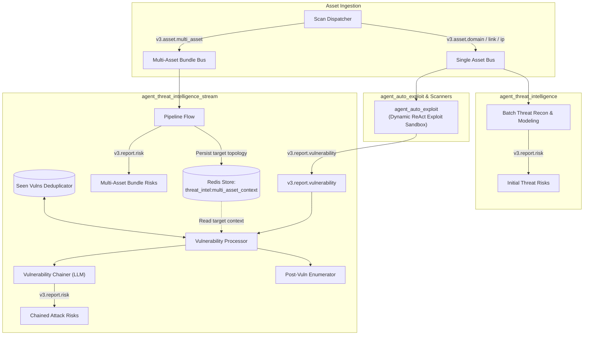
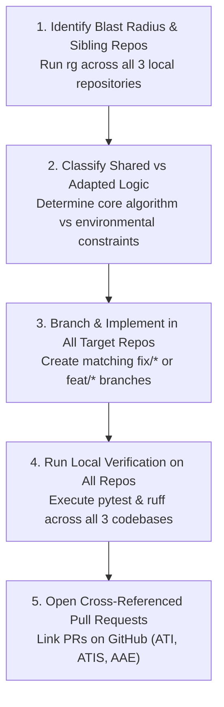

# Threat Intelligence & Auto-Exploit Cross-Agent Synchronization Guide

Standard operating procedure, architectural contracts, shared tool standards, and synchronization workflows across Ostorlab's primary security agent trio:
- [`agent_threat_intelligence`](https://github.com/Ostorlab/agent_threat_intelligence) (`Ostorlab/agent_threat_intelligence`): Batch reconnaissance and initial threat modeling.
- [`agent_threat_intelligence_stream`](https://github.com/Ostorlab/agent_threat_intelligence_stream) (`Ostorlab/agent_threat_intelligence_stream`): Streaming pipeline, multi-asset context persistence, and real-time vulnerability chaining.
- [`agent_auto_exploit`](https://github.com/Ostorlab/agent_auto_exploit) (`Ostorlab/agent_auto_exploit`): Autonomous offensive reasoning, dynamic exploit synthesis, and interactive verification.

---

## 🧭 1. The Agent Trio Architecture & Interdependencies

The three agents operate as a cohesive security intelligence and automated exploitation ecosystem. Understanding their specific roles, execution phases, and data buses is essential before making changes to any one of them.

```text
┌───────────────────────────────────────────────────────────────────────────────────────────────────────────────┐
│                                          OSTORLAB SECURITY AGENT TRIO                                         │
├─────────────────────────────────────┬─────────────────────────────────────┬───────────────────────────────────┤
│ agent_threat_intelligence           │ agent_threat_intelligence_stream    │ agent_auto_exploit                │
├─────────────────────────────────────┼─────────────────────────────────────┼───────────────────────────────────┤
│ • Batch Recon & Threat Modeling     │ • Streaming Intelligence Pipeline   │ • Autonomous Exploit Synthesis    │
│ • Static Asset Analysis             │ • Real-time Vulnerability Chaining  │ • Dynamic Verification Sandbox    │
│ • Initial Holistic Risk Assessment  │ • Multi-Asset Context Persistence   │ • Proof-of-Concept Generation     │
│ • Standalone Tool Functions         │ • Post-Vuln Attack Surface Enumerate│ • Class-Based Tool Providers      │
│ • DNS Pinning & Multi-URL SSRF Guard│ • DNS Pinning & Multi-URL SSRF Guard│ • Sandboxed `/workspace` Outputs  │
│ • Input: Asset (Domain, IP, Repo)   │ • Input: Multi-Asset & Vuln stream  │ • Input: Target Assets / Endpoints│
│ • Output: v3.report.risk            │ • Output: v3.report.risk            │ • Output: v3.report.vulnerability │
└─────────────────────────────────────┴─────────────────────────────────────┴───────────────────────────────────┘
```

### End-to-End Inter-Agent Communication & Data Flow

```text
┌─────────────────────────────────────────────────────────────────────────────────────────────────────────────┐
│                                       END-TO-END DATA & MESSAGE FLOW                                        │
└─────────────────────────────────────────────────────────────────────────────────────────────────────────────┘

                               Scan Dispatcher / Cloud Inject Asset
                                                 │
                                                 ▼
                              ┌──────────────────────────────────────┐
                              │         MULTI-ASSET INGESTION        │
                              │        (v3.asset.multi_asset)        │
                              └──────────────────┬───────────────────┘
                                                 │
                                 ┌───────────────┴───────────────┐
                                 ▼                               ▼
                 ┌─────────────────────────────┐ ┌─────────────────────────────┐
                 │ agent_threat_intelligence   │ │ agent_threat_intelligence_  │
                 │ (Batch Recon & Risk Model)  │ │ stream                      │
                 └──────────────┬──────────────┘ │ 1. Saves target context into│
                                │                │    Redis: multi_asset_context│
                                ▼                │ 2. Emits holistic initial   │
                        Initial Risks            │    bundle risks             │
                       (v3.report.risk)          └──────────────┬──────────────┘
                                                                │
                                              ┌─────────────────┘
                                              │
                                              ▼
                              ┌─────────────────────────────────┐
                              │ Scanners & agent_auto_exploit   │
                              │ • Autonomous offensive loops    │
                              │ • Dynamic exploit verification  │
                              └───────────────┬─────────────────┘
                                              │
                                              ▼  Emits Verified Findings (v3.report.vulnerability)
                              ┌─────────────────────────────────┐
                              │ agent_threat_intelligence_      │
                              │ stream (Vulnerability Processor)│
                              │ 1. Intercepts vulnerability     │
                              │ 2. Loads multi_asset_context    │
                              │ 3. Fetches seen vulnerabilities │
                              │ 4. Invokes VulnerabilityChainer │
                              │ 5. Invokes PostVulnEnumerator   │
                              └───────────────┬─────────────────┘
                                              │
                                              ▼
                                    Compound Attack Risks
                                      (v3.report.risk)
```



---

## ⚡ 2. The Mandatory Golden Rule of Cross-Agent Parity

> [!IMPORTANT]
> **Zero Orphaned Fixes (Mandatory Trio Audit)**: Any bugfix, security hardening, argument parser enhancement, prompt structure improvement, or tool feature introduced in **one** of the three sibling repositories MUST immediately be evaluated, adapted, and synchronized across the **other two repositories**.
>
> When opening a pull request or refactoring a tool in `agent_threat_intelligence`, `agent_threat_intelligence_stream`, or `agent_auto_exploit`, always conduct a cross-repo audit and submit matching PRs.

---

## 📐 3. Shared Tool Contracts & Divergence Matrix

While the three repositories share common tool ancestry, their execution runtimes and threat boundaries differ. Always observe the following shared contracts and deliberate divergences:

```text
┌─────────────────────┬─────────────────────────────────┬─────────────────────────────────┬────────────────────────────────┐
│ Dimension / Tool    │ agent_threat_intelligence       │ agent_threat_intelligence_stream│ agent_auto_exploit             │
├─────────────────────┼─────────────────────────────────┼─────────────────────────────────┼────────────────────────────────┤
│ Tool Architecture   │ Standalone functions            │ Standalone functions            │ Class providers (`Curl`, etc.) │
│                     │ (`run_curl`)                    │ (`run_curl`)                    │ (`curl_tl.run_curl`)           │
├─────────────────────┼─────────────────────────────────┼─────────────────────────────────┼────────────────────────────────┤
│ SSRF & DNS Pinning  │ STRICT: Pre-validates ALL URLs  │ STRICT: Pre-validates ALL URLs  │ N/A: Isolated sandbox runtime  │
│                     │ (`_extract_request_urls`)       │ (`_extract_request_urls`)       │ (No pre-validation required)   │
├─────────────────────┼─────────────────────────────────┼─────────────────────────────────┼────────────────────────────────┤
│ Output Files (-o)   │ Flag recognized in arg parser   │ Flag recognized in arg parser   │ SANDBOXED to `/workspace`      │
│                     │ (`VALUE_TAKING_CURL_FLAGS`)     │ (`VALUE_TAKING_CURL_FLAGS`)     │ (`/dev/null` preserved)        │
├─────────────────────┼─────────────────────────────────┼─────────────────────────────────┼────────────────────────────────┤
│ Write-Out (-w)      │ Preserves caller `-w` format    │ Preserves caller `-w` format    │ Preserves caller `-w` format   │
│                     │ (`_append_write_out_format`)    │ (`_append_write_out_format`)    │ (`_append_write_out_format`)   │
├─────────────────────┼─────────────────────────────────┼─────────────────────────────────┼────────────────────────────────┤
│ Response Extraction │ Conditional `stats_separator`   │ Conditional `stats_separator`   │ Conditional separator strip +  │
│                     │ strip                           │ strip                           │ `--- HTTP Headers ---` stderr  │
├─────────────────────┼─────────────────────────────────┼─────────────────────────────────┼────────────────────────────────┤
│ Context Persistence │ Scan Store Client / Cache       │ Redis `AgentPersistMixin`       │ Session History & Execution    │
│                     │                                 │ (`MULTI_ASSET_CONTEXT_KEY`)     │ Trace State                    │
└─────────────────────┴─────────────────────────────────┴─────────────────────────────────┴────────────────────────────────┘
```

---

## 🛠️ 4. Detailed Interdependency & Tool Specifications

### A. `curl` Tool & Web Networking Primitives
1. **Option & Flag Parsing**:
   - Support short standalone (`-o path`), short clustered (`-sS`), short glued (`-wFORMAT`, `-o/dev/null`), and long options (`--output path`, `--write-out FORMAT`).
   - Define `VALUE_TAKING_CURL_FLAGS` containing all flags that consume the subsequent token (`-o`, `--output`, `-d`, `--data`, `-u`, `-H`, `-A`, etc.) to prevent argument values from being misinterpreted as positional targets.
2. **Write-Out Format (`-w` / `--write-out`)**:
   - Inspect caller arguments using `_append_write_out_format()`.
   - If the caller supplies `-w` / `--write-out` (e.g. `curl -o /dev/null -w "%{http_code}" ...`), do **NOT** append default timing statistics (`Time elapsed: %{time_total}s`).
   - Only strip `stats_separator` when timing statistics were appended (`stats_appended is True`).
3. **Output Path Handling (`-o` / `--output`)**:
   - In `agent_threat_intelligence` & `agent_threat_intelligence_stream`: Ensure `-o` and `--output` values are skipped during URL extraction.
   - In `agent_auto_exploit`: Enforce that output paths resolve under `/workspace` (`CURL_OUTPUT_DIR`), but explicitly preserve `/dev/null` without prepending `/workspace/`.
4. **Multi-URL Target Extraction & SSRF Validation**:
   - In `agent_threat_intelligence` & `agent_threat_intelligence_stream`: Always use `_extract_request_urls()` to collect **all** positional URLs.
   - Validate every URL against DNS resolution to ensure no IP falls within private ranges (`10.0.0.0/8`, `172.16.0.0/12`, `192.168.0.0/16`, `127.0.0.0/8`) or cloud metadata endpoints (`169.254.169.254`).

---

### B. Vulnerability Contract & Chaining Interdependency
1. **Emission from `agent_auto_exploit`**:
   - `agent_auto_exploit` emits `v3.report.vulnerability` with technical details, curl reproduction scripts, risk rating, and `vulnerability_location` (e.g. `domain_name`, `ipv4_address`, `ios_store`, `android_store`).
2. **Ingestion & Parsing in `agent_threat_intelligence_stream`**:
   - `agent_threat_intelligence_stream` parses incoming findings via `VulnerabilityParser`.
   - `asset_type.get_asset_type_from_vulnerability_location()` maps the location to the correct asset family (Web, Mobile, Cloud, Infrastructure, Core).
   - `VulnerabilityChainer` selects the matching composite attack library (`library.get_library_for_asset_types()`).
3. **Target System Context Enrichment**:
   - When `v3.asset.multi_asset` is processed, `agent_threat_intelligence_stream` stores `str(MultiAssetElement)` into Redis under `threat_intel:multi_asset_context`.
   - When `VulnerabilityProcessor` processes a vulnerability, it loads `threat_intel:multi_asset_context` and passes `target_context` to `VulnerabilityChainer`.
   - `VulnerabilityChainer` injects `<target_system_context>` into the LLM prompt, enabling point findings (e.g. `/api/v1/debug` or hardcoded secret) to chain against known repositories, microservices, and mobile endpoints.

---

### C. `ffuf`, `crawler`, and OOB Listeners (`interactsh`)
1. **`ffuf` Wordlist Resolution**:
   - Wordlists must resolve to standard asset directories (`/agent/assets/` or `/workspace/wordlists`).
   - Concurrency caps (`-t`, `-p`) must be bound consistently across all agents.
2. **`crawler` Scope Pinning**:
   - Enforce domain boundary constraints to prevent spiders from following external third-party links out of scope.
   - Cap maximum crawl depth and total crawled pages uniformly.
3. **`interactsh` Out-of-Band Correlation**:
   - Used in `agent_auto_exploit` to confirm blind SSRF, blind RCE, and DNS callback exploits.
   - Polling sessions and interaction logs must be securely cleaned up after execution.

---

## 🔄 5. How Changes Must Account for Interdependencies (Blast Radius Checklist)

Before modifying any of the three agents, follow this blast radius decision tree:

```text
┌───────────────────────────────────────────────┬──────────────────────────────────────────────────────────────────┐
│ If you change...                              │ You MUST check and synchronize...                                │
├───────────────────────────────────────────────┼──────────────────────────────────────────────────────────────────┤
│ Networking tool (`curl`, `ffuf`, `crawler`)   │ • Update CLI flag parsing in all 3 repositories.                 │
│                                               │ • Verify `-w` write-out handling in all 3 repositories.          │
│                                               │ • Verify SSRF DNS validation in ATI & ATIS.                      │
│                                               │ • Verify `/workspace` path sandboxing & `/dev/null` in AAE.      │
├───────────────────────────────────────────────┼──────────────────────────────────────────────────────────────────┤
│ `v3.report.vulnerability` output in AAE       │ • Verify `VulnerabilityParser` in ATIS can parse fields cleanly. │
│                                               │ • Check `asset_type` location detection in ATIS.                 │
│                                               │ • Ensure `technical_detail` escapes HTML safely for prompt XML.  │
├───────────────────────────────────────────────┼──────────────────────────────────────────────────────────────────┤
│ Multi-Asset modeling in ATIS                  │ • Ensure `str(MultiAssetElement)` respects token budgets.        │
│                                               │ • Verify `MULTI_ASSET_CONTEXT_KEY` persistence consistency.      │
│                                               │ • Check `VulnerabilityChainer` prompt injection.                 │
├───────────────────────────────────────────────┼──────────────────────────────────────────────────────────────────┤
│ Prompt Analysis / Risk Areas in ATI           │ • Check parity with `agent_threat_intelligence_stream` flow.     │
│                                               │ • Verify risk area selectors and prompt templates.               │
└───────────────────────────────────────────────┴──────────────────────────────────────────────────────────────────┘
```

---

## 🚀 6. The 5-Step Cross-Agent Modification Workflow



### Step 1: Scan Sibling Repositories
```bash
# Search for matching tool, class, or pattern across all three codebases
rg -n "run_curl" agent_threat_intelligence/agent/
rg -n "run_curl" agent_threat_intelligence_stream/agent/
rg -n "run_curl" agent_auto_exploit/agent/
```

### Step 2: Determine Adaptations
- **Pure Core Logic** (argument parsing, regex, CVE lookup, prompt structures): Port identically to all three repositories.
- **Network Safety** (SSRF DNS validation, multi-URL extraction): Port to `agent_threat_intelligence` and `agent_threat_intelligence_stream`.
- **Sandbox / Filesystem** (output directory sandboxing, debugger sidecar): Port to `agent_auto_exploit`.

### Step 3: Implement on Matching Branches
Create matching branch names across repositories:
```bash
# In agent_threat_intelligence
git checkout -b fix/curl-write-out-override origin/main

# In agent_threat_intelligence_stream
git checkout -b fix/curl-write-out-override origin/main

# In agent_auto_exploit
git checkout -b fix/curl-write-out-override origin/main
```

### Step 4: Verify with Local Test Suites
```bash
# 1. agent_threat_intelligence
pytest agent_threat_intelligence/tests/
ruff check agent_threat_intelligence/agent/

# 2. agent_threat_intelligence_stream
pytest agent_threat_intelligence_stream/tests/
ruff check agent_threat_intelligence_stream/agent/

# 3. agent_auto_exploit
pytest agent_auto_exploit/tests/
ruff check agent_auto_exploit/agent/
```

### Step 5: Push and Open Cross-Referenced PRs
```bash
gh pr create --repo Ostorlab/agent_threat_intelligence --title "fix(curl): ..." --body "Sibling PRs: Ostorlab/agent_threat_intelligence_stream#425, Ostorlab/agent_auto_exploit#1365"
```

---

## 🚫 7. Red Flags & Anti-Patterns

| Anti-Pattern | Why It Causes Failure | Required Action |
| :--- | :--- | :--- |
| **Siloed Fix (One Repo Only)** | Creates tech debt and leaves known vulnerabilities or tool breakage in sibling agents. | Always inspect and patch all three repos simultaneously. |
| **Blind Copy-Paste to `agent_auto_exploit`** | Breaks class structure or omits `/workspace` path sandboxing and header stderr extraction. | Adapt core logic to `agent_auto_exploit`'s class-based tool pattern. |
| **Omitting Multi-URL SSRF in `agent_threat_intelligence_stream`** | Allows SSRF bypass via secondary positional arguments in curl. | Always extract and validate all positional URLs with `_extract_request_urls()`. |
| **Rewriting `/dev/null` in `agent_auto_exploit`** | Pollutes the workspace with dummy files (`/workspace/dev/null`) and breaks status code probes. | Explicitly exempt `/dev/null` from path rewriting. |
| **Unconditional Stats Separator Stripping** | Strips legitimate tool output or status code probes when caller `-w` is provided. | Only strip separator when `stats_appended is True`. |
| **Tight Coupling of Persistence Across Agents** | Hard-coding shared Redis keys across distinct agents creates race conditions and brittle deployments. | Keep persistence self-contained per agent; communicate strictly via Ostorlab message protobufs. |
| **Unescaped Vulnerability Details in Chainer Prompts** | Unescaped HTML/XML in vulnerability descriptions breaks LLM XML tag parsing (`<technical_detail>`). | Always wrap dynamic fields with `html.escape()`. |

---

## 🧪 8. Cross-Agent Reviewer Checklist

When reviewing PRs on any of the three repositories:
- [ ] **Trio Audit**: Was this change checked against `agent_threat_intelligence`, `agent_threat_intelligence_stream`, and `agent_auto_exploit`?
- [ ] **Argument Safety**: Are value-taking flags (`-o`, `-d`, `-H`, etc.) properly registered in `VALUE_TAKING_CURL_FLAGS`?
- [ ] **Option Parsing**: Does option parsing handle glued (`-wFORMAT`), clustered (`-swFORMAT`), and long-form flags?
- [ ] **SSRF Multi-URL Check**: If in `threat_intel` or `threat_intel_stream`, are all positional URLs validated against private/metadata IPs?
- [ ] **Sandbox Safety**: If in `auto_exploit`, are output paths restricted to `/workspace` while preserving `/dev/null`?
- [ ] **Vulnerability & Chaining Parity**: If modifying vulnerability schema or location types, is `VulnerabilityParser` and `asset_type` in ATIS compatible?
- [ ] **Persistence Encapsulation**: Is persistence self-contained via `AgentPersistMixin`?
- [ ] **Prompt XML Escaping**: Are all dynamic strings in prompt templates safely escaped with `html.escape()`?
- [ ] **Condition Clarity**: Are all boolean conditions explicit (`if cond is True:`, `if len(items) == 0:`)?
- [ ] **Test Coverage**: Are unit tests added following `test<Action>_when<Condition>_<ExpectedResult>`?

