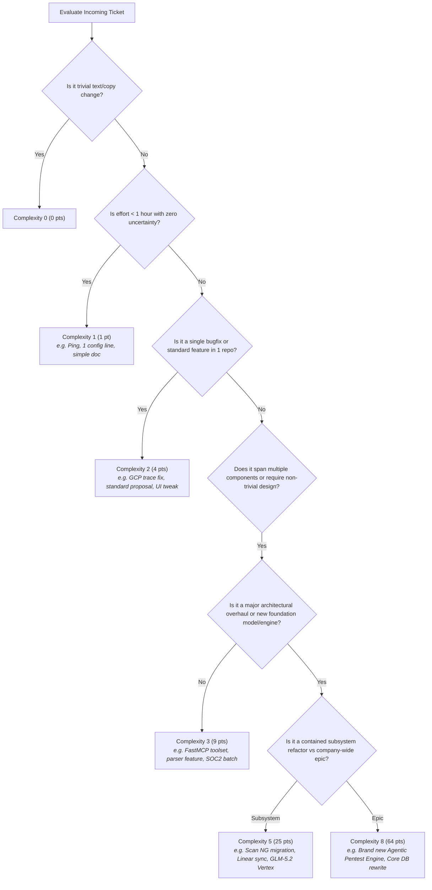

# Ostorlab Ticket Complexity & Quadratic Impact System

Standard framework and operating procedure for evaluating, scoring, and assigning complexity to Ostorlab tickets.

---

## 1. The Quadratic Impact Model

Ostorlab uses a Fibonacci-style complexity scale where **Impact Points** scale as the **square of complexity**:

$$\text{Impact Points} = (\text{Complexity})^2$$

| Complexity ($C$) | Impact Points ($C^2$) | Target Effort | Core Archetype |
|:---:|:---:|:---:|---|
| **0** | **0** | $< 15\text{ mins}$ | Trivial maintenance, text copy updates, non-functional cleanup |
| **1** | **1** | $15\text{ mins} - 1\text{ hour}$ | Micro-tasks, isolated config changes, prospect pings, simple questionnaire review |
| **2** | **4** | $1 - 3\text{ hours}$ | Standard bug fix, single GCP error group remediation, standard commercial proposal |
| **3** | **9** | Half-day to Full day | Multi-component feature, parser enhancements, SOC2 fixes, custom client negotiation |
| **4** | **16** | $1 - 2\text{ days}$ | Complex multi-system feature, deep engine debugging, cross-service schema + migration |
| **5** | **25** | $2 - 4\text{ days}$ | Subsystem refactoring, new service integration, model deployment (Vertex AI), RASP bypass |
| **8** | **64** | $1 - 2\text{ weeks}$ | Major architectural epic, brand-new autonomous agent engine, core schema paradigm shift |

### Why the Quadratic ($C^2$) Weighting Matters
* **Combats Ticket Inflation**: Eliminates the incentive to cherry-pick easy micro-tasks over hard, high-leverage problems. Completing **one Complexity 5 ticket (25 pts)** delivers the impact equivalent of **25 Complexity 1 tickets (1 pt each)** or ~**3 Complexity 3 tickets (9 pts each)**.
* **Reflects Non-Linear Cognitive Load**: Uncertainty, cross-service coordination, edge cases, and regression risks multiply rather than add up linearly.

---

## 2. The 5-Factor Evaluation Rubric

When evaluating an incoming ticket, evaluate across these 5 dimensions:

```
┌────────────────────────────────────────────────────────────────────────────────────────┐
│  1. Scope & Touchpoints       : 1 file / isolated  ───▶  Multi-service / DB Migration  │
│  2. Uncertainty / Discovery   : Clear recipe       ───▶  Heavy R&D / Unreproduced Bug  │
│  3. Blast Radius & Risk       : No risk / internal ───▶  Auth / Billing / Prod Scans   │
│  4. Dependencies              : Autonomous         ───▶  External API / Client / Org   │
│  5. Execution Effort          : < 30 mins          ───▶  Multiple days                 │
└────────────────────────────────────────────────────────────────────────────────────────┘
```

| Dimension | **Complexity 1** ($1\text{ pt}$) | **Complexity 2** ($4\text{ pts}$) | **Complexity 3** ($9\text{ pts}$) | **Complexity 5** ($25\text{ pts}$) | **Complexity 8** ($64\text{ pts}$) |
|---|---|---|---|---|---|
| **Scope** | Single file or single config | 2–3 files in 1 repo | Across 2 layers (backend + MCP, or API + UI) | Cross-repo or full subsystem overhaul | Entire product line / new agent family |
| **Uncertainty** | 0% (Exact change known) | Low (Known fix, standard debug) | Medium (Requires design or parser exploration) | High (New architecture, vendor API unknowns) | Extreme (Research problem, unknown feasibility) |
| **Blast Radius** | None (internal script/docs) | Low (isolated bug fix) | Medium (affects scan pipeline or ticket flows) | High (data migration, billing, auth, SOC2) | Critical (core platform runtime stability) |
| **Dependencies** | None | Standard library / internal | 1 external service or client response | Multi-agent coordination, Cloud infra | Multiple external vendors + production cutover |
| **Effort** | $< 1\text{ hour}$ | $1 - 3\text{ hours}$ | Half-day to 1 day | $2 - 4\text{ days}$ | $1 - 2\text{ weeks}$ |

---

## 3. Decision Tree: Quick Triage Recipe



---

## 4. Benchmark Ticket Reference Catalog

Use these historical Ostorlab tickets as calibration anchors:

### 🟢 Complexity 0 ($0\text{ pts}$)
* `os-36511` / `os-36512` / `os-36502`: Translate email flow templates to Spanish, Chinese, French.
* `os-36410`: Remove remaining places where deprecated scan repository fields are referenced.

### 🔵 Complexity 1 ($1\text{ pt}$)
* **Sales & GTM**: `os-36386` (*Ping Aramco*), `os-36388` (*Ping Tesco*), `os-36381` (*Ping Veolia*), `os-35546` (*Share PoC access to covalent.global*).
* **Engineering**: `os-36371` (*Add GCS argument in agent group in RE for TI stream*), `os-36477` (*Remove OKR from impact*), `os-36032` (*Update internal-docs with permission instructions*).
* **Operations**: `os-36369` (*Pay reimbursements*), `os-35653` (*Bill payments*).

### 🟡 Complexity 2 ($4\text{ pts}$)
* **GCP Error Group Fixes**: `os-29187` (*GCP error in runners/gcp_errors_tracker*), `os-10703` (*APICallError in agent request sender*), `os-24126` (*Invalid bundle id check in iOS action executor*), `os-14746` (*JSONDecodeError handling in agent parser*).
* **Engineering & Infra**: `os-36478` (*Investigate Google Vertex AI usage*), `os-36476` (*Add new models to BYOK*), `os-36812` (*Disable GCP logging in agent_binary_ninja*).
* **Customer Support & Proposals**: `os-36285` (*Answer 3bankin*), `os-36289` (*Answer NBI*), `os-31514` (*Send invoice UCB*), `os-35901` (*Register for Code Blue Conference*).

### 🟠 Complexity 3 ($9\text{ pts}$)
* **Agentic Workflows & Toolsets**: `os-35326` (*Enrich ticket FastMCP tools with tags, agents, filters*), `os-34467` (*Implement asset validation agentic workflow*), `os-36140` (*Threat intelligence stream: multi-asset context agent*), `os-29157` (*Create memory corruption executor*).
* **Platform & Compliance**: `os-35618` (*Implementing Tags in Scans*), `os-35928` (*Cleanup access for SOC2*), `os-35931` (*Fix automated tests for SOC2 on Vanta*).
* **Customer Engagements**: `os-36445` (*Send offer to Inwi*), `os-36457` (*Investigate PG claims of false positives*), `os-35762` (*Design outbound campaign for multi-asset scanning*).

### 🔴 Complexity 5 ($25\text{ pts}$)
* **Core Refactors**: `os-36262` (*Refactor Scan to NG models*), `os-27919` (*Migrate Header and ScanForm UI*), `os-36025` (*Add full typing to Reporting Engine*).
* **Infrastructure & Model Deployments**: `os-36276` (*Deploy and integrate Vertex AI for GLM-5.2*), `os-36242` (*Support Linear integration end-to-end*).
* **Deep Security Research**: `os-36394` (*Bypass real device check for com.bank.cbt*), `os-36302` (*TBB 13 bypasses*).

### 🟣 Complexity 8 ($64\text{ pts}$)
* Brand-new autonomous pentesting agent family from scratch.
* Core database relational redesign across scans, vulnerabilities, targets, and assets.
* End-to-end multi-cloud scanning grid redesign with dynamic resource orchestration.

---

## 5. How to Set Ticket Complexity on Ostorlab

Ticket complexity is persisted in Ostorlab as a tag with:
* `name`: `"complex"`
* `value`: `"<0|1|2|3|5|8>"`

### Via FastMCP Tool `update_ticket`
When updating an existing ticket:

```json
{
  "ticket_key": "os-36801",
  "tags": [
    {"name": "complex", "value": "3"},
    {"name": "feature", "value": ""}
  ]
}
```

### Via FastMCP Tool `create_ticket`
When creating a new ticket with complexity:

```json
{
  "title": "Threat intelligence stream: multi-asset context agent",
  "priority": "p0",
  "status": "open",
  "assigned_email": "user@example.com",
  "tags": [
    {"name": "complex", "value": "3"},
    {"name": "feature", "value": ""}
  ]
}
```
