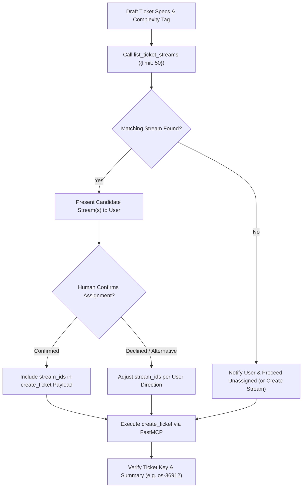

# Ostorlab Ticket Creation & Stream Assignment Protocol

Standard operating procedure for authoring, evaluating, stream-matching, human-validating, and creating tickets on the Ostorlab platform.

---

## 🧭 Workflow & Architecture

```text
┌────────────────────────────────────────────────────────────────────────────────────────┐
│                               Ticket Creation Flow                                     │
├────────────────────────────────────────────────────────────────────────────────────────┤
│  1. Draft Specification  ───▶  Title, Description, Acceptance Criteria, Priority & Tag │
│                                                                                        │
│  2. Stream Discovery     ───▶  Query Active Streams via FastMCP `list_ticket_streams`  │
│                                                                                        │
│  3. Stream Matching      ───▶  Identify Candidate Streams (Name, Scope, Description)   │
│                                                                                        │
│  4. Human Validation     ───▶  Prompt User to Confirm / Select Target Stream           │
│                                                                                        │
│  5. Execute Ticket       ───▶  Invoke `create_ticket` with `stream_ids`, tags & params │
│                                                                                        │
│  6. Enrich (Optional)    ───▶  Add Checklists (`create_checklist`) or Comments         │
└────────────────────────────────────────────────────────────────────────────────────────┘
```



---

## 📋 1. Ostorlab Ticket Authoring Standards

Every Ostorlab ticket must adhere to structured formatting to maintain engineering velocity and clarity.

### Ticket Fields Specification

| Field | Required | Description / Allowed Values | Default / Convention |
| :--- | :---: | :--- | :--- |
| **`title`** | **Yes** | Concise, action-oriented summary (< 80 chars). | E.g. *"Implement CIDR range validation in asset scope"* |
| **`description`** | **Yes** | Markdown body with Problem, Proposed Fix & Acceptance Criteria. | Standard Ostorlab Markdown template (see below). |
| **`priority`** | No | `"p0"` (Outage/Crit), `"p1"` (High/Blocker), `"p2"` (Normal), `"p3"` (Low), `"p4"` (Trivial). | `"p2"` |
| **`status`** | No | `"open"`, `"in_progress"`, `"fixed"`, `"closed"`, `"verified"`. | `"open"` |
| **`assigned_email`**| No | Email of responsible developer or engineer. | `null` or user email (e.g. `user@example.com`) |
| **`tags`** | No | List of `{"name": "...", "value": "..."}` objects. | At minimum: `{"name": "complex", "value": "<0|1|2|3|5|8>"}` |
| **`stream_ids`** | No | Array of integer stream IDs after human validation. | `[<stream_id>]` |
| **`vulnerability_ids`**| No | Linked vulnerability IDs if remediation-focused. | Optional |
| **`scan_ids`** | No | Linked scan IDs if discovered in a scan. | Optional |

---

### Standard Ticket Markdown Template

```markdown
### Background & Objective
Brief 1-2 sentence description explaining the problem, bug, or feature objective.

### Technical Details & Scope
- **Affected Components:** Services, files, or endpoints impacted.
- **Root Cause / Architecture:** Why the issue occurs or design considerations.

### Acceptance Criteria
- [ ] Core functionality implemented according to specifications
- [ ] Unit & integration tests added with full coverage
- [ ] Multi-tenant isolation verified (active organisation validation)
- [ ] No regression in existing pipelines or APIs
```

---

## 🔍 2. Ticket Stream Discovery & Human Validation Protocol

Ostorlab organizes initiatives, sprints, and epics into **Ticket Streams**. When creating tickets, agents MUST prevent orphan tickets by identifying matching streams and validating the association with the user.

### Step 1: Query Active Streams
Call the FastMCP tool `list_ticket_streams` to fetch active and planned streams:

```json
{
  "ServerName": "ostorlab",
  "ToolName": "list_ticket_streams",
  "Arguments": {
    "limit": 50,
    "statuses": ["in_progress", "planned"]
  }
}
```

### Step 2: Evaluate Stream Relevance
Compare the ticket's title, scope, and affected subsystems against active streams:
* Check stream `name` and `description`.
* Check stream `lead` and active `members`.
* Match common domains (e.g., UI/UX $\rightarrow$ *Platform Redesign*, Infra $\rightarrow$ *Autoscale Prod*, Emulators $\rightarrow$ *Custom Emulators*, Threat Intel $\rightarrow$ *Threat Intelligence*).

### Step 3: Human Validation (Mandatory Gate)
> [!IMPORTANT]
> **Zero Unconfirmed Stream Associations**: NEVER attach a ticket to a stream without presenting the match and obtaining human confirmation.

When a candidate stream is identified:
1. Present the candidate stream clearly to the user:
   * **Stream Name & ID**: e.g. `Stream #34: "Platform Redesign"`
   * **Stream Description**: e.g. *"Enhance platform UX to better align with customer feedback."*
   * **Confidence / Rationale**: Why this ticket matches the stream's scope.
2. Ask the user for confirmation:
   * *"Found matching stream: **#34 Platform Redesign**. Would you like to assign this ticket to this stream?"*
3. If confirmed $\rightarrow$ populate `"stream_ids": [34]`.
4. If declined or an alternative stream is specified $\rightarrow$ adjust or omit `stream_ids` accordingly.
5. If no streams match $\rightarrow$ notify the user and ask whether to proceed unassigned or create a new stream via `create_ticket_stream`.

---

## 🏷️ 3. Complexity Sizing & Tagging

Ostorlab tickets enforce the **Quadratic Impact Model** ($\text{Impact} = C^2$). Always evaluate the 5 dimensions from `ticket-complexity` (Scope, Uncertainty, Blast Radius, Dependencies, Effort) and tag the ticket:

```json
"tags": [
  {"name": "complex", "value": "3"},
  {"name": "area", "value": "remediation"}
]
```

| Complexity | Effort | Typical Scope |
|:---:|:---:|---|
| **0** | $< 15\text{ mins}$ | Copy update, non-functional cleanup, trivial docs |
| **1** | $15\text{ mins} - 1\text{ hr}$ | Isolated single-file fix, ping prospect, simple questionnaire |
| **2** | $1 - 3\text{ hrs}$ | Standard single-repo bug fix, GCP trace group fix, standard quote |
| **3** | Half to Full Day | Multi-component feature, FastMCP toolset, SOC2 task batch |
| **5** | $2 - 4\text{ days}$ | Subsystem refactor, Vertex AI model deployment, new service |
| **8** | $1 - 2\text{ weeks}$ | Major architectural epic, brand-new autonomous agent engine |

---

## 🛠️ 4. FastMCP Tool Execution Examples

### Example 1: Creating a Validated Stream Ticket

```json
{
  "ServerName": "ostorlab",
  "ToolName": "create_ticket",
  "Arguments": {
    "title": "Add keyboard focus trapping to modal dialogs",
    "description": "### Background\nModal dialogs currently do not trap keyboard tab focus, leading to accessibility violations.\n\n### Scope\n- Update `UiDialog` and confirmation modals.\n\n### Acceptance Criteria\n- [ ] Tab cycles exclusively within modal elements when open\n- [ ] Escape key triggers modal close\n- [ ] Focus restored to trigger button on exit",
    "priority": "p2",
    "status": "open",
    "assigned_email": "user@example.com",
    "stream_ids": [34],
    "tags": [
      {"name": "complex", "value": "2"},
      {"name": "area", "value": "frontend"}
    ]
  }
}
```

### Example 2: Adding a Checklist Post-Creation

After `create_ticket` returns a `ticket_key` (e.g. `os-36915`):

```json
{
  "ServerName": "ostorlab",
  "ToolName": "create_checklist",
  "Arguments": {
    "ticket_key": "os-36915",
    "title": "Definition of Done"
  }
}
```

---

## 🚫 Common Anti-Patterns & Mistakes

| Anti-Pattern | Why It Fails | Correct Protocol |
| :--- | :--- | :--- |
| **Skipping Stream Check** | Creates disconnected orphan tickets that get lost in sprint reviews. | Always query `list_ticket_streams` before creating tickets. |
| **Silent Auto-Assignment** | Misclassifies tickets under unrelated initiatives without domain context. | Present the match and obtain explicit human confirmation first. |
| **Missing Acceptance Criteria** | Causes ambiguity during implementation and PR review. | Always include a markdown checklist (`- [ ]`) in the description. |
| **Arbitrary Complexity Scale** | Breaks quadratic impact metrics ($C^2$). | Strictly use values `0`, `1`, `2`, `3`, `5`, or `8` in tag `complex`. |
| **Linear "Save Changes" Text** | Violates Ostorlab UX standards. | Keep action terminology concise (`Save`, `Create`, `Update`). |
