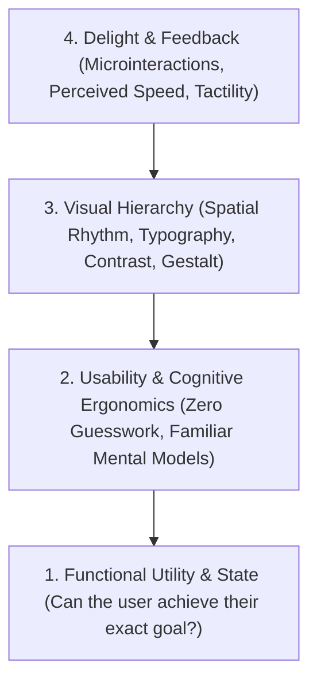
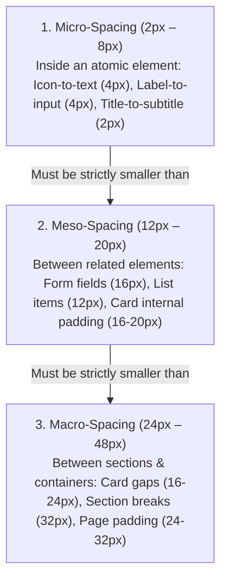
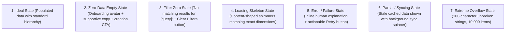
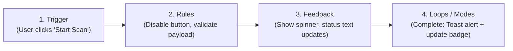

# UX & UI Design: Principles, Heuristics & Mental Models

Definitive reference guide for building intuitive, human-centered, and high-clarity software interfaces, synthesized from cognitive psychology and foundational interaction design literature (*Laws of UX*, *Designing Interfaces*, *Don't Make Me Think*, *Designing with the Mind in Mind*, *Microinteractions*, *Strategic Writing for UX*).

---

## 🧠 The Mental Model: The 4-Layer Interface Pyramid

Never treat user interfaces as cosmetic decoration. An interface is an **operational control room for the human brain**. Evaluate every screen from the bottom layer upward:



1. **Utility (The Substrate)**: Does the screen provide the exact information and capabilities needed to complete the user's immediate job-to-be-done?
2. **Cognitive Ergonomics (The Brain)**: Does the interface leverage preexisting mental models? Is cognitive friction minimized so the user never has to guess how to proceed?
3. **Visual Hierarchy (The Eye)**: Where do the user's eyes land in the first 50 milliseconds? Are primary, secondary, and tertiary elements effortlessly distinguishable?
4. **Delight & Polish (The Nervous System)**: Does the UI respond instantaneously? Are error states empathetic and recoverable? Does the system feel sturdy and intentional?

---

## 📐 Psychological Laws of UX

### 1. Jakob's Law (Familiarity over Novelty)
*Users spend most of their time using other products. They expect your product to behave like the products they already know.*
- **Guideline**: Do not reinvent core interaction patterns (e.g. search boxes, filter drawers, navigation bars, dropdowns, table pagination).
- **Rule**: Be creative with your core domain value proposition, never with standard UI plumbing.

### 2. Hick's Law (Decision Time Increases with Options)
*The time it takes to make a decision increases logarithmically with the number and complexity of choices ($T = b \cdot \log_2(n + 1)$).*
- **Guideline**: Employ **Progressive Disclosure**. Never present 25 fields at once; split complex tasks into logical, stepped wizards or disclosure accordions.
- **Rule**: Every screen must have exactly **one** obvious primary Call-to-Action (CTA). Secondary and tertiary actions must be visually subordinate.

### 3. Fitts's Law (Target Distance & Size)
*The time required to rapidly move to a target area is a function of the ratio between the distance to the target and the width of the target.*
- **Guideline**: Interactive touch/click targets must be comfortably sized:
  - Mobile: Minimum **$44 \times 44\text{px}$** (iOS HIG) or **$48 \times 48\text{dp}$** (Material).
  - Desktop: Minimum **$32 \times 32\text{px}$** with generous click padding.
- **Rule**: Place high-frequency actions close to the user's current focal point (or sticky at the screen bottom on mobile).

### 4. Miller's Law & Chunking
*Working memory capacity is limited to $7 \pm 2$ items.*
- **Guideline**: Break long strings and data tables into digestible chunks:
  - Format numbers, credit cards, dates, and phone numbers with clear delimiters (`YYYY-MM-DD`, `XXXX-XXXX-XXXX-XXXX`).
  - Cap dashboard metric cards to 4–6 primary indicators per view.

### 5. The Peak-End Rule
*People judge an experience largely based on how they felt at its peak (the most intense point) and at its conclusion, rather than the average of every moment.*
- **Guideline**: Invest heavily in transition milestones:
  - **Success states**: Celebrate completion (e.g., successful deployment, scan finished, payment confirmed) with clear summaries and next steps.
  - **Error recovery**: Make recovery painless, clear, and reassuring.

### 6. Postel's Law / Robustness Principle (Forgiving Formats)
*Be liberal in what you accept, and conservative in what you send. (Jon Yablonski, Laws of UX)*
- **Guideline**: Never punish the user for entering valid data in an unexpected format:
  - Automatically parse URLs with or without `https://`, strip whitespace from IP addresses / CIDRs, accept dates in multiple regional notations (`YYYY-MM-DD`, `MM/DD/YYYY`), and clean phone/credit card inputs.
- **Rule**: Client-side formatters must sanitize and transform inputs silently before sending payloads.

### 7. Recognition Over Recall (Memory Fragility)
*Human working memory can hold only 4–7 chunks of data and degrades in seconds. (Jeff Johnson, Designing with the Mind in Mind)*
- **Guideline**: Never require users to remember IDs, tokens, configuration keys, or settings from one tab/screen to type into another.
- **Rule**: Provide search-as-you-type comboboxes, entity chips, recent item lists, and inline context summaries rather than bare, unassisted text fields.

### 8. Visual Scent & The 5-Second Test
*Users do not read web pages; they forage for visual scent that matches their immediate goal. (Jeff Johnson)*
- **Rule**: Every screen must answer three questions within 5 seconds without scrolling:
  1. **Where am I?** (High-contrast page header + clear breadcrumbs)
  2. **What is happening here?** (Primary status summary card, metrics, or table)
  3. **What is my primary next action?** (One dominant primary CTA button)

### 9. The Doherty Threshold ($< 400\text{ms}$)
*Productivity skyrockets when computer and user interact at a pace where neither has to wait on the other. (Jon Yablonski)*
- **Guideline**: Provide instant visual feedback ($< 100\text{ms}$) for all clicks and keystrokes.
- **Rule**: Complete state transitions in $< 400\text{ms}$. Use **Optimistic UI updates** for lightweight actions (toggles, favorites, tagging) and skeleton screens for server fetches exceeding $300\text{ms}$.

### 10. Serial Position Effect (Primacy & Recency)
*Users best recall the first (Primacy) and last (Recency) items in a series. (Jon Yablonski)*
- **Rule**: In sidebars, toolbars, and dropdown menus:
  - Place primary operational destinations (Overview, Dashboard, Primary CTAs) at the **top/first position**.
  - Place terminal management items (Settings, Account, Documentation, Logout) at the **bottom/last position**.
  - Place routine middle-frequency tools in the center.

### 11. Action Safety: Transient "Undo" over Blocking Modals
*Modals interrupt flow and cause alert fatigue; instant undo empowers users with speed and safety. (Jenifer Tidwell, Designing Interfaces)*
- **Rule**: For non-catastrophic, reversible actions (archiving, moving, unassigning tags, removing filter chips), execute immediately and display a floating Toast notification with a clear **Undo** action ($5\text{s}$ timeout).
- **Rule**: Reserve blocking modal dialogs strictly for irreversible, high-consequence actions (e.g. permanently deleting a database, revoking production API credentials).

### 12. Poka-Yoke & Single-Column Form Cadence
*Mistake-proof interactions by designing constraints that prevent errors before they happen. (Form Design Patterns, Luke Wroblewski & Adam Silver)*
- **Rule**: Use sensible constraints (disable past dates in future schedulers, lock incompatible dropdowns, use number steppers) so invalid states cannot be entered.
- **Rule**: Keep forms in a **single vertical column**. Multi-column layouts cause users to misread fields in zigzag scanning patterns. Only place tightly coupled sub-fields (e.g. `City + State + Zip`, `First + Last Name`) side-by-side.

---

## 🎨 Visual Design System & Spatial Rhythm

### 1. The 3-Tier Spatial Rhythm (Base-4 / Base-8 Grid)
Never use arbitrary margin or padding values (`7px`, `13px`, `19px`, `23px`). Layouts and components must strictly adhere to a 3-tier spatial rhythm:



| Token | Size | Hierarchy Level | Concrete UI Application |
| :--- | :--- | :--- | :--- |
| `space-0.5` | `2px` | Micro | Title-to-subtitle vertical micro-gap, badge optical adjustment |
| `space-1` | `4px` | Micro | Icon-to-text gap, button gap, label-to-input vertical gap |
| `space-2` | `8px` | Micro | Tight element spacing, button horizontal padding, dropdown item margins |
| `space-3` | `12px` | Meso | Compact component padding, table row vertical padding, dense inputs |
| `space-4` | `16px` | Meso | Standard card internal padding, form field vertical separation (`gap-4`) |
| `space-6` | `24px` | Macro | Card-to-card gap, modal section spacing, major form group breaks |
| `space-8` | `32px` | Macro | Page header to main content, major section dividing gutters |
| `space-12` | `48px` | Macro | Macro layout boundaries, hero banner spacing, empty state hero breaks |

### 2. The Fundamental Law of Proximity ($Micro < Meso < Macro$)
> [!IMPORTANT]
> **The Spacing Inequality**: The distance between related items *inside* a component must **always be visibly smaller** than the distance separating that component from external elements.
>
> - **Ambiguous Spacing Anti-Pattern**: Placing uniform `16px` gaps between everything (label to input: 16px; input to next label: 16px). This destroys visual grouping because the brain cannot determine whether the input belongs to the label above or the label below.
> - **Clear Proximity Pattern**:
>   - Label to Input: `4px` (Micro gap binds them as a single cognitive unit).
>   - Input to Helper/Validation text: `4px` (Micro gap binds feedback to field).
>   - Field to Next Field: `16px - 20px` (Meso gap signals an independent new item).

### 3. Component Boundary Encapsulation & Layout Ownership
- **Components Own Internal Padding (`p-*`), Never Outer Margins (`m-*`)**: Reusable buttons, badges, inputs, and cards must never set hardcoded outer margins. Outer spacing is strictly the responsibility of parent layout stacks (`d-flex ga-4`, `v-row`, CSS grid).
- **Avoid Nested Card Inception**: Never nest bordered cards inside bordered cards inside panels. Group child elements with subtle background tone shifts (`#f8fafc` vs `#ffffff`) and intentional whitespace rather than heavy nested borders.

### 4. Multi-Variable Visual Hierarchy (The Hierarchy Triad)
Establish hierarchy through **the triad of Size, Weight, and Tonal Contrast**, rather than relying solely on massive font sizes:

```
┌────────────────────────────────────────────────────────────────────────┐
│                        THE HIERARCHY TRIAD                             │
│                                                                        │
│  [ Primary Title ]        20px - 24px, Bold 700, Slate 900 (#0f172a)   │
│  [ Section Header ]       15px - 16px, Semi-bold 600, Slate 900        │
│  [ Primary Body / Data ]  13.5px - 14px, Medium 600, Slate 800 (#1e293b)│
│  [ Secondary Metadata ]   12px - 13px, Regular 400-500, Slate 600      │
│  [ Tertiary / Captions ]  11px - 12px, Medium 500, Slate 500 (#64748b) │
└────────────────────────────────────────────────────────────────────────┘
```

- **De-emphasize to Emphasize**: If every element is high-contrast, the screen is visual noise. To make a key metric or CTA stand out, tone down the elements surrounding it (use muted `#e2e8f0` borders, `#64748b` metadata, and `#f8fafc` surfaces).
- **Labels as a Last Resort**: Eliminate redundant `Label: Value` clutter when formatting makes context intuitive. Let font weight and structure convey meaning instead of prefixing everything with labels.
- **Line Height (Leading)**:
  - Body copy ($14\text{px} - 16\text{px}$): `line-height: 1.5` to `1.6` for optimal reading cadence.
  - Headings ($20\text{px}+$): `line-height: 1.15` to `1.25` to prevent loose, disconnected lines.

### 5. Surface Elevation, Cards & Borders
- **Card Rounding Convention**: Cards must **not** be rounded excessively (avoid `rounded-xl`, `rounded-2xl`, `16px+`). Standardize on limited rounding: **`6px` (`rounded-md`) / max `8px` (`rounded-lg`)**.
- Avoid heavy, dark drop shadows (`rgba(0,0,0,0.5)`).
- Layer subtle shadows with crisp borders (`1px solid rgba(0, 0, 0, 0.08)` in light mode, `1px solid rgba(255, 255, 255, 0.1)` in dark mode) to create clean, legible surface separation.

### 6. Master Button Architecture & Semantic Color Rules
- **No Primary Color on Action Buttons**: Avoid defaulting to generic primary blue on buttons.
- **Main Action Buttons**: MUST use `variant="elevated"`.
  - **Success Actions** (Save, Update, Confirm, Create, Connect): Use `color="success"`.
  - **Neutral Main Actions**: Use `color="accent"`.
  - **Destructive Actions**: Use `color="error"`.
- **Secondary Action Buttons**: MUST use `variant="outlined"`.
- **Cancel & Clear Buttons**: MUST use a **neutral color** (e.g. `variant="outlined"` with `color="grey-darken-1"` / neutral grey styling). Avoid saturated or vibrant colors for cancel/clear.
- **Neutral Actions**: Use `color="accent"` or neutral outlined styling.

### 8. Optical Alignment & Table Physics
*Mathematical centering is often optically unbalanced.*

- **Icon vs Multi-Line Text Optical Alignment**:
  - ❌ `align-items: center` in flex rows with multi-line text (the icon floats awkwardly centered beside a 3-line paragraph).
  - ✅ `align-self: flex-start; margin-top: 2px;` to optically lock the icon to the **cap-height of the first line of text**.
- **Table Column Alignment Physics**:
  - **Text & Identifiers**: Always **Left-aligned**.
  - **Numeric Data, Counts, Latencies, Dates & Currency**: Always **Right-aligned** with `font-variant-numeric: tabular-nums` so decimal points and digits stack perfectly.
  - **Status Badges & Row Actions**: Always **Right-aligned** or strictly centered.
- **Optical Geometry Adjustments**:
  - Asymmetric icons (e.g. play triangle, chevron): Apply `1px - 2px` optical right shift (`transform: translateX(1px)`).
  - Badges beside mixed-case headers: Apply `1px` optical vertical drop to align with font x-height.

### 9. Reading Ergonomics & Content Measure
- **The 65ch Measure Rule**:
  - Reading continuous text across wide screens causes severe eye tracking fatigue.
  - Paragraphs, descriptions, and documentation **must be constrained to $45 - 75\text{ characters}$ per line** (`max-width: 65ch` / `max-w-prose`).
- **Text Truncation Strategies**:
  - **Middle Truncation** for hashes, tokens, and filepaths (`0x4a8f...9b2c` / `app/.../auth.vue`).
  - **End Ellipsis with Tooltip** for long user-generated titles (`text-truncate`).
  - **Multi-Line Clamp** (`-webkit-line-clamp: 2`) for card summaries and description blocks.

### 10. Surface Layering & Dark Mode Physics
*Dark mode is never pure `#000000` inverted white.*

- **The Slate Staircase (Layered Elevation)**:
  - Pure black (`#000000`) on OLED causes harsh halation (ocular vibration) and destroys visual depth.
  - Use progressive slate elevation tokens:
    - **App Canvas (Base)**: `#0b0f17` (or `#0f172a`)
    - **Cards & Surfaces (Mid)**: `#1e293b` with hairline `1px solid rgba(255,255,255,0.08)` border
    - **Popovers, Menus & Dialogs (Top)**: `#334155` with soft ambient shadow
- **Ambient Tinted Shadows**:
  - Never use harsh, muddy black shadows (`rgba(0,0,0,0.4)`). Shadows should inherit a subtle tint of the surface or slate background (`rgba(15, 23, 42, 0.08)` in light mode, `rgba(0, 0, 0, 0.5)` in dark mode).

---

## 🔄 The 7-State Component Lifecycle (State Exhaustion)

Never design only the "Happy Path". Every production component, card, and table must account for all 7 lifecycle states:



---

## 📝 Form Ergonomics & Validation Timing

- **Reward Early, Punish Late (Validation Timing)**:
  - ❌ **Never validate on initial keystroke**: Showing "Invalid email" after typing "a" increases cognitive friction and user anxiety.
  - ✅ **Validate on `blur`** (when user leaves the field) or upon form submission.
  - ✅ **Re-validate on `input` ONLY after an error has occurred** to immediately clear the error as soon as the input is corrected.
- **Micro-Proximity for Form Feedback**:
  - Helper and error text must sit strictly **`4px` directly beneath the input field** (`text-caption`), never floating ambiguously in the margin.
  - Use proper HTML input attributes (`type="email"`, `inputmode="numeric"`, `autocomplete="one-time-code"`).

---

## ⌨️ Keyboard-First Ergonomics & Focus Management

- **Dialog & Modal Focus Trapping**:
  - When a modal opens: Focus automatically moves to the first interactive field (or primary cancel button for destructive modals).
  - Background scrolling is locked (`overflow: hidden`).
  - Pressing `Esc` immediately dismisses the modal.
  - On modal close: Focus **MUST return to the trigger button** that opened it, preventing focus loss to `<body>`.
- **Keyboard Power-User Standards**:
  - Command Palettes (`⌘K` / `Ctrl+K`) for global navigation and fast search.
  - Data table keyboard traversal (`↑/↓` or `j/k` row navigation, `Enter` to select/open).

---

## ⚡ Interaction Design, Motion Physics & Choreography

Every interactive state must adhere to Dan Saffer's 4-part microinteraction loop:



### 1. Response Time Thresholds
- **$< 100\text{ms}$ (Instant)**: Hover, active/pressed, and focus states must reflect immediately to confirm input receipt.
- **$100\text{ms} - 300\text{ms}$ (Perceived Fast)**: UI transitions and modal animations.
- **$> 300\text{ms}$ (Loading Required)**: Always show a skeleton loader or progress indicator.
- **$> 10\text{s}$ (Long-Running)**: Provide percentage progress, estimated time remaining, or asynchronous notification.

### 2. Natural Motion Deceleration Curves
- Never use `linear` transitions for UI components.
- **Entering elements**: Fast acceleration into gentle deceleration (`cubic-bezier(0.16, 1, 0.3, 1)` or `ease-out`, duration `200ms - 300ms`).
- **Exiting elements**: Fast acceleration off-screen (`ease-in`, duration `100ms - 150ms`).
- **Staggered List Choreography**: When animating multi-row lists, stagger row reveals with `animation-delay: calc(index * 30ms)`.
- **Respect `prefers-reduced-motion`**:
  ```css
  @media (prefers-reduced-motion: reduce) {
    *, *::before, *::after {
      animation-duration: 0.01ms !important;
      transition-duration: 0.01ms !important;
    }
  }
  ```

---

## ✍️ Strategic UX Writing & Microcopy

*Reference: [Strategic Writing for UX](https://learning.oreilly.com/library/view/-/9781098174323/?orm_source=mcp) (Torrey Podmajersky)*

Every word on an interface is a functional component.

| Scenario | ❌ Weak / Anti-Pattern | ✅ Clear & Actionable Pattern |
| :--- | :--- | :--- |
| **Destructive Modal Buttons** | `OK` / `Cancel` | `Delete 5 Repositories` / `Keep Repositories` |
| **Error Messages** | `Error 500: An unexpected error occurred.` | `We couldn't save your scan settings. Please verify your connection and try again.` |
| **Empty States** | `No items found.` | `No security vulnerabilities found. Run a new scan or adjust your active filters.` *(+ Primary CTA)* |
| **Form Inputs** | `Date` | `Start Date (YYYY-MM-DD)` |
| **Permissions / Access** | `Forbidden` | `You need Workspace Admin permissions to modify SSO configurations. Contact your team admin.` |

---

## ♿ Accessibility & Cognitive Inclusivity (WCAG AA Standards)

1. **Color Contrast**:
   - Body text ($< 18\text{pt}$ / $< 24\text{px}$): Minimum contrast ratio of **$4.5:1$** against background.
   - Large text ($\ge 18\text{pt}$ / $\ge 24\text{px}$ or bold $\ge 14\text{pt}$): Minimum **$3:1$**.
   - UI components & borders (inputs, checkboxes, icons): Minimum **$3:1$**.
2. **Never Rely on Color Alone**:
   - Accompany red/green status indicators with icons, distinct shapes, or explicit text badges (`Active`, `Failed`, `Pending`).
3. **Keyboard Navigation & Focus Rings**:
   - All interactive elements must have a visible, high-contrast focus indicator (`outline: 2px solid var(--accent)`). Never set `outline: none` without providing a custom focus replacement.
4. **Form Labels & Error Association**:
   - Explicitly link `<label for="id">` and `<input id="id">`. Use `aria-describedby` to associate helper text and validation errors with their inputs.

---

## 📋 The 12-Point UX/UI Master Review Checklist

Execute this checklist before approving any interface or shipping a frontend feature:

- [ ] **1. Single Clear Primary Action**: Does the page or modal have one visually dominant primary CTA?
- [ ] **2. 50ms Hierarchy Scan**: Can a user understand what the page does and where to look within 1 second without reading blocks of text?
- [ ] **3. The Law of Proximity ($Micro < Meso < Macro$)**: Are related items (e.g. label-to-input 4px) grouped noticeably closer than separate items (e.g. field-to-field 16px)?
- [ ] **4. Multi-Variable Hierarchy Triad**: Is visual hierarchy established via Size + Weight + Tonal Contrast rather than solely oversized font sizes?
- [ ] **5. Optical Alignment & Table Physics**: Are numeric data columns right-aligned with `tabular-nums`? Are icons optically aligned to the first line's cap-height?
- [ ] **6. 7-State Lifecycle Coverage**: Are empty states, search-zero states, loading skeletons, error recovery, and text overflow handled?
- [ ] **7. Reading Ergonomics (Measure)**: Are text paragraphs constrained to $\le 65\text{ch}$ to prevent reading fatigue?
- [ ] **8. Form Validation Timing**: Does validation trigger on `blur` rather than premature keystrokes, and re-validate on `input` only after error?
- [ ] **9. Keyboard Focus & Esc Trapping**: Do modals trap focus, dismiss on `Esc`, and restore focus to trigger element on close?
- [ ] **10. Touch Target Dimensions**: Are all clickable/tappable elements $\ge 44\times 44\text{px}$ on touch or $\ge 32\times 32\text{px}$ on desktop?
- [ ] **11. WCAG AA Contrast**: Does all text meet the $4.5:1$ contrast ratio in both light and dark modes?
- [ ] **12. 8pt/4pt Spatial Rhythm**: Are all layout gaps, padding, and margins strictly derived from the 4px/8px design token grid?
