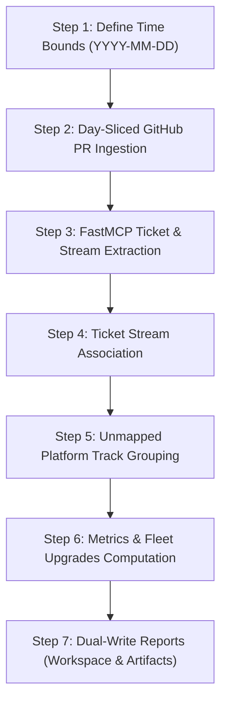

# Weekly Engineering & Product Work Summary Runbook

A standardized, fully reproducible methodology for ingesting organization-wide pull requests, extracting FastMCP tickets, mapping accomplishments to official **Ostorlab Ticket Streams**, capturing unmapped platform initiatives, and generating structured executive reports.

---

## 🧭 Workflow Overview



---

## 🛠️ Step-by-Step Reproducible Approach

### Step 1: Establish Date Bounds
Always define explicit, ISO-8601 formatted date bounds (`YYYY-MM-DD`):
- **Single Sprint / Last Week:** The 7-day window ending on the current date (e.g., `2026-08-17` to `2026-08-24`).
- **Multi-Week Snapshot:** The full 4-week window (e.g., `2026-07-27` to `2026-08-24`).

```python
import datetime

today = datetime.date.today()
last_week_start = today - datetime.timedelta(days=7)
print(f"Window: {last_week_start.isoformat()} to {today.isoformat()}")
```

---

### Step 2: Day-Sliced GitHub PR Ingestion (Bypassing 200-Item Cap)

> [!IMPORTANT]
> GitHub CLI (`gh search prs`) caps single query results to 200 items. Running a single broad query across an organization with 100+ repositories will truncate data. Always slice ingestion by single calendar days.

Execute the bundled helper script or run the Python slice engine:

```bash
python3 ~/.config/agent-skills/plugins/ostorlab/skills/weekly-work-summary/scripts/fetch_weekly_data.py \
  --org Ostorlab \
  --start-date 2026-08-17 \
  --end-date 2026-08-24 \
  --output-dir ./scratch
```

#### Inline Day-Slice Python Engine:
```python
import datetime, json, subprocess

def fetch_prs_by_day(org: str, start_str: str, end_str: str) -> list[dict]:
    start = datetime.date.fromisoformat(start_str)
    end = datetime.date.fromisoformat(end_str)
    delta = datetime.timedelta(days=1)
    all_prs = {}
    current = start
    while current <= end:
        d = current.isoformat()
        cmd = ["gh", "search", "prs", f"owner:{org}", f"created:{d}", "--limit", "1000",
               "--json", "number,title,state,url,createdAt,closedAt,repository,author,labels"]
        res = subprocess.run(cmd, capture_output=True, text=True)
        if res.returncode == 0 and res.stdout:
            for pr in json.loads(res.stdout):
                all_prs[f"{pr['repository']['name']}-{pr['number']}"] = pr
        current += delta
    return list(all_prs.values())
```

---

### Step 3: FastMCP Ticket & Stream Extraction

Query the authenticated Ostorlab FastMCP server:

1. **Active Ticket Streams:**
   Call tool `list_ticket_streams` with `{}` to retrieve:
   - Stream ID, Name, Lead email, Members, Target completion date, and Linked ticket IDs.
2. **Updated Tickets (Last 7 Days):**
   Call tool `list_tickets` with `{limit: 200, modified_since: 7, sort: "modified"}`.
   Call tool `list_tickets` with `{limit: 200, created_since: 7, sort: "created"}`.

#### Parsing FastMCP NDJSON / Concatenated Output:
```python
import json

def parse_mcp_output(raw_content: str) -> list[dict]:
    decoder = json.JSONDecoder()
    items, pos = [], 0
    while pos < len(raw_content):
        while pos < len(raw_content) and raw_content[pos].isspace(): pos += 1
        if pos >= len(raw_content): break
        try:
            obj, end_pos = decoder.raw_decode(raw_content, pos)
            if isinstance(obj, list): items.extend(obj)
            elif isinstance(obj, dict):
                if "tickets" in obj: items.extend(obj["tickets"])
                elif "ticket_streams" in obj: items.extend(obj["ticket_streams"])
                else: items.append(obj)
            pos = end_pos
        except Exception: break
    return items
```

---

### Step 4: Map Progress to Ostorlab Streams

Create a lookup table mapping stream IDs to their official names and leads:

| Stream ID | Stream Name | Stream Lead | Scope & Key Repositories |
| :--- | :--- | :--- | :--- |
| **`1`** | **MCP** | `@mohamed.nasser` | FastMCP endpoints, tool exposure, schema types, documentation. |
| **`5`** | **CyberGym** | `@sohaibharraoui` | SVA benchmarks, finding-to-CWE mapping, `Research` batch CLIs. |
| **`4`** | **OnPrem Switch** | `@MouadAO` | Scanner migration, `oxo` risk assets, scheduler race conditions. |
| **`9`** | **Asset Table Migration** | `@Oussama-Bakri` | Multi-asset continuous rules, `agent_cloud_inject_asset`, downloaders. |
| **`7`** | **Shielding Detection** | `@ohachimOs` | Anti-tampering, biometric checks, WDA/Appium diagnostic fixes. |
| **`3` & `6`** | **Pricing & Estimator** | `@Nouri-Anouar` & `@m0hamed-ait` | Cost calculators, malus approval permissions, lead estimation. |
| **`8`** | **Office Change** | `@manal` | Operations, facilities logistics, physical onboarding. |

---

### Step 5: Group Unmapped Platform Engineering Tracks

Identify major technical achievements that operated outside the 7 formal streams:
1. **Ticket Streams Engine Core:** Data models, Django migrations, and GraphQL schema in `ogle_reporting_engine`.
2. **Autonomous Exploit Agent (`agent_auto_exploit`):** Compiler toolchains (`clang`/`llvm`/`gdb`), Tree-sitter AST, Android ROP execution.
3. **Autonomous PR Reviewer Bot (`pr_review_agent`):** Airflow DAG decoupling, DeepSeek V4 Pro, reviewer scoring, diff line indexing.
4. **Autonomous Monkey Tester (`agent_monkey_tester`):** Screen coordinate mapping, OTP serialization locks, `open_deep_link`/`shake` strategies.
5. **Streaming Threat Intelligence:** APK inspectors, Binary Ninja analysis integration, network diagnostic suites.
6. **Growth & Serverless CRM:** Nuxt 3 (Vercel) + Supabase Serverless stack migration.
7. **Marketing & Security Research:** Conference CFPs (Hackfest, Insomni'hack), Coldcard research, automated Pelican CI/CD builds.

---

### Step 6: Calculate Statistics & Model Modernization

Quantify the following metrics:
- **PR Status Distribution:** Merged, Open, Closed/Superseded.
- **PR Review Volumes & Activity:** Total PR reviews conducted via GitHub GraphQL `viewer.contributionsCollection(from: "...", to: "...")` and repository breakdown.
- **Ticket Status Breakdown:** Work Done (Fixed/Closed) vs Work Pending (Open/Reopened by P0, P1, P2).
- **Top Active Repositories:** Rank top 10-15 repositories by merged PRs.
- **Contributor Rankings:** Top authors by PR volume and focus domain.
- **Model Upgrades:** List agents updated to `gemini-3.7-flash`, `DeepSeek V4 Pro`, `GLM 5.3`, etc.

---

### Step 7: Dual-Write Reports

Always write the formatted Markdown to two locations:
1. **Workspace File:** `<workspace_dir>/LAST_WEEK_SUMMARY.md` or `<workspace_dir>/SUMMARY.md`.
2. **Artifact Document:** `<appDataDir>/brain/<conversation-id>/last_week_summary.md` (via `write_to_file` with `UserFacing: true`).

---

## 📋 Markdown Report Template

When formatting the summary, use standard GitHub Markdown with Mermaid diagrams and clickable links:

````markdown
# Engineering & Product Work Summary (<Timeframe>)

## 📊 1. Executive Summary & Metrics


| Metric | Total Count | Percentage |
| :--- | :--- | :--- |
| **Total Pull Requests Created** | **<Total>** | 100% |
| **Successfully Merged** | **<MergedCount>** | <MergedPct>% |
| **Tickets Resolved / Fixed** | **<DoneTickets>** | - |

---

## 🎯 2. Progress Mapped to Ostorlab Streams

### 🔌 Stream #1: MCP (Model Context Protocol)
* **Lead:** <Lead Name> (`<email>`) | Target: <Date>
* **Mapped Deliverables:**
  * [#PR_NUM](<PR_URL>): Feature description.

---

## 🚫 3. Unmapped Engineering Initiatives

### 🤖 Autonomous PR Review Bot (`pr_review_agent`)
* **Key Achievements:**
  * [#PR_NUM](<PR_URL>): Feature description.

---

## ⏳ 4. Actionable Pending Backlog (Work To Be Done)

### Critical P0 Incidents & Fixes
* **[#TICKET_ID](<URL>)**: Error description, module path, and reproduction details.

### P1 Feature Epics
* **[#TICKET_ID](<URL>)**: Architectural milestone description.
````

---

## ⚠️ Common Pitfalls & Solutions

| Pitfall | Cause | Solution |
| :--- | :--- | :--- |
| **Missing PRs in busy orgs** | `gh search prs` default limit caps at 200 | Always slice searches day-by-day (`created:YYYY-MM-DD`). |
| **JSONDecodeError on MCP output** | FastMCP outputs concatenated JSON objects | Use `json.JSONDecoder().raw_decode` in a position loop. |
| **Missing ticket streams context** | Tickets exist without linked stream names | Query `list_ticket_streams` first to build a `ticket_id -> stream_name` mapping. |
| **Date boundary drift** | Comparing ISO timestamps with plain date strings | Truncate timestamps with `[:10]` or parse with `datetime.fromisoformat`. |
